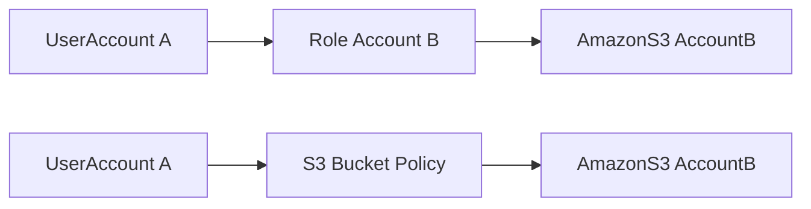

### 사전지식 1.  STS(Security Token Service)

#### ***STS***(Security Token Service) 란? #IAM/STS

**STS(Security Token Service)는 특정 시간 동안만 유효한 임시 보안 자격 증명이다. 

**<font color="#de7802">IAM 역할에 대한 임시자격 증명에 사용되는 인증방식임.   </font>**

### STS(Security Token Service) 사용사례
* **<font color="#de7802">연합 사용자 접근 (Federation Access)</font>** : 회사의 직원, 제3자 서비스 사용자 등이 AWS 리소스에 접근해야하는 경우, STS 를 사용하여 임시자격 증명을 발급받을 수 있다.

* **<font color="#de7802">교차 계정 액세스 (Cross-Account Access)</font>** : 다른 AWS 계정의 리소스에 접근해야하는 경우 , 예를 들면 
계정 A의 애플리케이션이 계정 B의 S3 버킷에 접근해야할 때 , 계정 A에서 STS를 사용하여 계정 B에서 임시 자격 증명을 발급받아 접근 할 수 있다.

*  <font color="#de7802">모바일 앱 및 웹 애플리케이션 </font>
모바일 앱이나 웹 애플리케이션이 직접 AWS 리소스에 접근해야 할 때, STS 를 사용하여 임시 자격 증명을 발급 받을 수 있다. 예를 들면 모바일 앱에서 사용자 인증 후 STS를 통해 임시 자격 증명을 받아 S3버킷에 파일을 업로드하거나 다운로드 할 수 있다. 

<font color="#00b050"><u>Python Boto3 라이브러리를 사용하여 STS를 통해 임시 자격 증명을 요청하고 이를 사용하는 예시 </u></font>
```python
import boto3

# STS 클라이언트 생성
sts_client = boto3.client('sts')

# 다른 역할의 임시 자격 증명 요청
response = sts_client.assume_role(
    RoleArn='arn:aws:iam::123456789012:role/other-role',  # 접근하려는 역할의 ARN
    RoleSessionName='other-role-session',                 # 세션 이름
    DurationSeconds=3600                                  # 자격 증명의 유효 기간 (최대 1시간)
)

# 임시 자격 증명 추출
credentials = response['Credentials']
access_key = credentials['AccessKeyId']
secret_key = credentials['SecretAccessKey']
session_token = credentials['SessionToken']

# 임시 자격 증명을 사용하여 다른 서비스 클라이언트 생성
s3_client = boto3.client(
    's3',
    aws_access_key_id=access_key,
    aws_secret_access_key=secret_key,
    aws_session_token=session_token
)

# S3 버킷 목록 가져오기
response = s3_client.list_buckets()
buckets = [bucket['Name'] for bucket in response['Buckets']]

print("S3 Buckets:", buckets)
```


#### *AWS IAM* 이란? #IAM/AWS_IAM이란

AWS IAM(Identity and Access Management)는 사용자(Users), 그룹(Groups) ,역할(Roles) (3가지 합쳐서 엔티티라함)의 권한을 관리하여 AWS 리소스에 대한 접근을 제어할 수 있도록 하는 서비스 

### AWS IAM Entity
* **Users** 
	* 가장 기본적인 IAM 자격 증명, AWS 환경 내의 리소스에 액세스할 수 있는 사람이다. 
	* 기본적으로 사용자에게는 작업을 수행할 수 있는 권한이 없다.
* **Groups**
	* 사용자에게 권한을 부여하는 프로세스를 단순화한다.
	* 각 사용자에게 개별적으로 권한을 할당하는 대신 그룹을 만들고 해당 그룹에 권한을 할당할 수 있습니다. 
	* 한 명의 사용자가 여러 그룹에 속할 수 있다. 그러나 그룹은 중첩될 수 없다.
* **Roles**
	* 단일 자격 증명을 나타낸다는 점에서 사용자와 유사하며, AWS 내의 리소스에 액세스할 수 있는 권한을 할당할 수 있다. -> STS 서비스를 이용해 지원 가능
	* 차이점은 역할은 임시 자격 증명을 사용한다. 즉, 암호나 액세스 키를 저장하거나 암호화할 필요가 없다. 임시 작업을 위해 모든 사용자에게 역할을 할당할 수 있으며 해당 작업이 완료되면 해당 역할에 대한 액세스 권한을 취소할 수 있다. 따라서 사용자와 서비스에 AWS의 리소스에 대한 액세스 권한을 부여하는 훨씬 더 안전한 옵션이 됩니다.
	* **사용사례**
		* EC2 Instance Roles
		* Service Roles
		* Cross-Account Role (교차 계정 역할) : IAM의 기능이지만 한 AWS 계정의 사용자나 서비스가 다른 AWS 계정의 리소스에 접근할 수 있도록 허용하는 기능임 - (STS 의 cross account access 를 사용하여 자격증명 이루어짐 )

### 사전지식 2. IAM Policy #IAM/IAM_Policy
IAM에서는 사용자, 그룹, 역할에 대한 관리를 위해 정책(Policy)을 사용한다 

정책은 크게 <font color="#00b050"> 세가지</font> 유형으로 나눌 수 있다. 

#### 1. AWS Managed Policies
AWS는 일반적인 사용사례를 기반으로 제공하는 미리 정의된 정책.
* <font color="#de7802">자동 업데이트</font>: AWS가 정책을 관리하고 새로운 서비스나 기능이 추가되면 업데이트 해줌 
* <font color="#de7802">손쉬운 사용</font> : AWS가 관리해주니 관리부담이 적고 빠르게 설정 가능
* <font color="#de7802">읽기 전용</font> : AWS가 관리하기 때문에 수정(custom) 이 불가능-> 커스텀이 필요하면 Customer Managed Policy 를 생성 할 수 있다. 
<u>EX) : AmazonS3ReadOnlyAccess, AmazonEC2FullAccess </u>
#### 2. Customer Managed Policies
고객이 직접 생성하고 관리하는 정책.
* <font color="#de7802">커스터마이징 가능</font> : AWS Managed Policies 과는 다르게 수정할 수 있음. 
* <font color="#de7802">버전 관리</font> : 정책(Policy)의 여러 버전을 만들고 관리 할 수 있음. (커스터마이징의 주체가 고객이니 당연)
* <font color="#de7802">재사용 가능</font> : 여러사용자, 그룹, 역할에 쉽게 할당 할 수 있다. (재사용 뿐만 아니라 상황에 맞게 커스텀가능)
* <font color="#de7802">관리 책임</font> : 정책의 관리와 유지보수는 고객의 책임                    (커스터마이징의 주체가 고객이니 당연)
<u>EX) : 특정 S3 버킷에 대한 읽기/쓰기 권한을 부여하는 정책 등 </u>

#### 3. Inline Policies
특정 사용자, 그룹, 역할(이하 <font color="#de7802">엔티티</font>로 서술)에 직접 연결된 정책. 정책이 연결된 <font color="#de7802">엔티티와 생명주기를 공유한다. </font>
* <font color="#de7802">직접 연결</font> : 특정 엔티티에 직접 연결되며, 해당 엔티티 삭제되면 정책도 삭제됨. 
* <font color="#de7802">고유성</font> : 재사용되지 않으며, 특정 엔티티에만 적용됨.
* <font color="#de7802">관리 부담</font> : 여러 엔티티에 걸쳐 동일한 정책을 적용할 때 관리부담이 증가 할 수 있음.
(엔티티가 한 두개가 아닐거니깐 개별설정 시  관리부담 됨)
* <font color="#de7802">유연성</font> : 특정 상황에 맞게 세부적으로 권한을 설정할 수 있다. 
<u>EX) : 특정 역할(Role)에만 적용되는 정책 등</u>

### 사전지식 3. AWS Service Roles

AWS Service Roles 는 IAM 역할의 일종으로, AWS 서비스 자체가 역할을 맡아 필요한 권한을 부여받아 작업을 수행하도록 한다. (aws 인스턴스가 IAM 에 의해 ROLE을 부여 받는다면 이게 AWS Service Roles)
1. **서비스에 대한 권한 부여**:
    
    - 특정 AWS 서비스가 다른 AWS 리소스에 접근하거나 작업을 수행할 수 있도록 필요한 권한을 부여합니다.
    - 예를 들어, EC2 인스턴스가 S3 버킷에 접근하여 데이터를 읽거나 쓸 수 있도록 설정할 수 있습니다.
2. **정책 연결**:
    
    - 역할(Role)에 정책(Policy)을 연결하여 서비스가 수행할 수 있는 작업을 정의합니다.
    - 이 정책은 서비스가 수행할 수 있는 API 작업과 리소스를 명시합니다.
3. **신뢰 정책(Trust Policy)**:
    
    - 어떤 서비스가 이 역할을 맡을 수 있는지를 정의하는 신뢰 정책(Trust Policy)을 포함합니다.
    - 신뢰 정책은 역할을 맡을 수 있는 주체(Principal)를 명시합니다. 주체는 AWS 서비스, 사용자, 계정 등이 될 수 있습니다.
4. **임시 보안 자격 증명**:
    
    - 역할을 맡은 서비스는 임시 보안 자격 증명을 사용하여 작업을 수행합니다. 이러한 자격 증명은 일정 시간이 지나면 자동으로 만료됩니다.

### AWS Service Roles의 사용 예시

1. **Amazon EC2**:
    
    - EC2 인스턴스가 S3 버킷에 접근할 수 있도록 EC2 인스턴스 프로파일을 설정할 때 사용됩니다.
    - 예시: EC2 인스턴스가 애플리케이션 로그를 S3 버킷에 저장하도록 설정.
2. **AWS Lambda**:
    
    - Lambda 함수가 다른 AWS 리소스에 접근할 수 있도록 역할을 부여할 때 사용됩니다.
    - 예시: Lambda 함수가 DynamoDB 테이블에서 데이터를 읽고 쓰도록 설정.
3. **Amazon RDS**:
    
    - RDS 인스턴스가 S3 버킷에 백업 파일을 저장할 수 있도록 역할을 부여할 때 사용됩니다.
    - 예시: RDS 인스턴스가 S3 버킷에 자동 백업을 저장하도록 설정.
### 사전지식 4. EC2 Instance Role

<font color="#00b050">하나의 AWS EC2 인스턴스는 하나의 IAM Role만 가질 수 있다. </font>

### IAM Policies Deep Dive

IAM Policies 는 주로 json 문서로 구성한다

- `Version`: 정책 언어의 버전
- `Statement`: 정책의 주요 요소로, 하나 이상의 권한 부여 문을 포함
- `Effect`: 정책의 효과, 보통 "Allow" 또는 "Deny"
- `Action`: 허용하거나 거부할 작업
- `Resource`: 정책이 적용되는 리소스
- `Condition`(선택 사항): 정책이 적용될 조건
```JSON
{
    "Version": "2012-10-17",
    "Statement": [
        {
            "Effect": "Allow",
            "Action": "s3:ListBucket",
            "Resource": "arn:aws:s3:::example_bucket"
        },
        {
            "Effect": "Allow",
            "Action": "s3:GetObject",
            "Resource": "arn:aws:s3:::example_bucket/*"
        }
    ]
}

```

<font color="#de7802"> AWS IAM 정책 평가의 기본규칙</font>
1. 명시적 거부(Deny) :  명시적 거부는 언제나 우선
2. 명시적 허용(Allow) : 명시적 거부가 없다면 보다 명시적(구체적)으로 허용된 옵션이 우선

예시
```json

{
    "Effect": "Allow",
    "NotAction": "iam:*",
    "Resource": "*"
},
{
    "Effect": "Allow",
    "Action": "iam:CreateServiceLinkedRole",
    "Resource": "*"
}

```

- 첫 번째 정책에서 `NotAction: "iam:*"`은 `iam:*` 작업을 제외한 모든 작업을 허용
그러나 두 번째 정책에서 `Action: "iam:CreateServiceLinkedRole"`가 더 명시적(구체적)으로 `iam:CreateServiceLinkedRole` 작업을 허용하므로 해당 작업은 허용됨

IAM Policies Conditions
IAM Policy를 좀 더 세밀하게 제어하는데 사용하는 조건
Condition 블록 내에서 정의되며 여러 조건을 결합가능  

```json
{
    "Version": "2012-10-17",
    "Statement": [
        {
            "Effect": "Allow",
            "Action": "s3:ListBucket",
            "Resource": "arn:aws:s3:::example_bucket",
            "Condition": {
                "StringEquals": { // 문자열이 정확히 일치하는지 확인 
                    "aws:username": "example_user"
                }
            }
        }
    ]
}

```

IAM Policies Variables and Tags

IAM Policies 를 더욱더 동적으로 만들기 위해 사용

```json
{
    "Version": "2012-10-17",
    "Statement": [
        {
            "Effect": "Allow",
            "Action": "s3:ListBucket",
            "Resource": "arn:aws:s3:::example_bucket",
            "Condition": {
                "StringEquals": {
                    "s3:prefix": "${aws:username}/*"
                }
            }
        }
    ]
},{
    "Version": "2012-10-17",
    "Statement": [
        {
            "Effect": "Allow",
            "Action": "ec2:StartInstances",
            "Resource": "*",
            "Condition": {
                "StringEquals": {
	                //Owner태그가 요청 주체의 사용자 이름과 일치하는지 확인
                    "aws:RequestTag/Owner": "${aws:username}" 
                }
            }
        }
    ]
}


```

### IAM Roles vs Resource Based Policies 



1. UserAccount  A 가 Account B의 역할을 얻어서 Account B의 S3 Bucket 에 접근하는경우
Account B 역할을 사용하는 동안 A 계정에서의 모든 권한을 포기한다. 

2. AccountB의 S3 bucket 에 정책이 UserAccount A의 접근을 허용한다면 UserAccount A는 어떤
권한도 포기 할 필요가 없음

## IAM Permission Boundaries

IAM Permission Boundaries(권한 경계)는 AWS IAM에서 사용자 또는 역할이 가질 수 있는 최대 권한을 정의하는 정책. 권한 경계는 조직 내에서 권한을 제한하고, 특정 사용자나 역할이 필요 이상으로 권한을 가지지 않도록 한다.

```json
{
    "Version": "2012-10-17",
    "Statement": [
        {
            "Effect": "Allow",
            "Action": [
                "s3:GetObject",
                "s3:PutObject"
            ],
            //특정 사용자나 역할이 `example-bucket` 버킷에 대해 객체를 읽고 쓸 수 있도록 허용
            "Resource": "arn:aws:s3:::example-bucket/*"
        }
    ]
}

```

```json
{
    "Version": "2012-10-17",
    //`example-bucket` 버킷에서 객체를 삭제할 수 있는 권한을 부여받았지만, 권한 경계에 의해 이 권한은 제한됩니다.
    "Statement": [
        {
            "Effect": "Allow",
            "Action": "s3:DeleteObject",
            "Resource": "arn:aws:s3:::example-bucket/*"
        }
    ]
}


```

IAM Access Analyzer
IAM 콘솔내의 서비스로 어떤 리소스가 외부에서 공유되고 있는지 알아내는데 사용한다. 

**Zone of Trust 설정**: 특정 신뢰 구역(zone of trust) 내에서만 접근이 허용되도록 설정할 수 있습니다. 이를 통해 신뢰할 수 있는 계정이나 리소스에 대한 접근만 허용하고, 기타 접근은 제한?할 수 있습니다.

예를들면 S3 Bucket 을 기준으로 role, user, VPC endpoints 를 zone of Trust로 묶어놓으면 zone of Trust (신뢰영역)바깥의 account 나 External Client 에서 접근이 일어날경우 플래그로 표시되고 콘솔에서
확인이 가능하다 . 보안리스크로 판단되면 처리해야함 

IAM Access Analyzer Policy Validation Policy Validation 
IAM Access Analyzer의 기능중 하나 
IAM Access Analyzer Policy Validation 은 policy 문법 체크 뿐만아니라 모범사례에 맞춰 정책을 검증할 수있음. 

IAM Access Analyzer Policy Generation
사용자가 수행한 작업에 기반하여 필요한 최소 권한만을 포함하는 정책을 자동으로 생성해줌 

에를 들면 Lambda function이 동작하면 Kinesis Data Streams 에서 S3 Bucket의 데이터를 수집하는 flow가 있다면 이러한 일련의 API Call은 CloudTrail 에 기록된다. 이 때 생성된 로그는 (최대90일까지)  IAM Access Analyzer에 의해 분석 및 검토되고 거기에 기반한 정책을 생성한다. 

---

Providing Access to AWS Accounts Owned by Third Parties

Outside zone of Trust = 3rd Parties = 트러스트존 바깥에 있는 리소스

AWS ARN(Amazon Resource Name)
AWS 리소스를 고유하게 식별하기 위해 사용되는 식별자

![[Pasted image 20240614004752.png]]