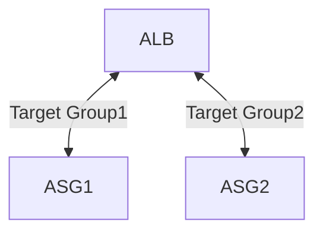
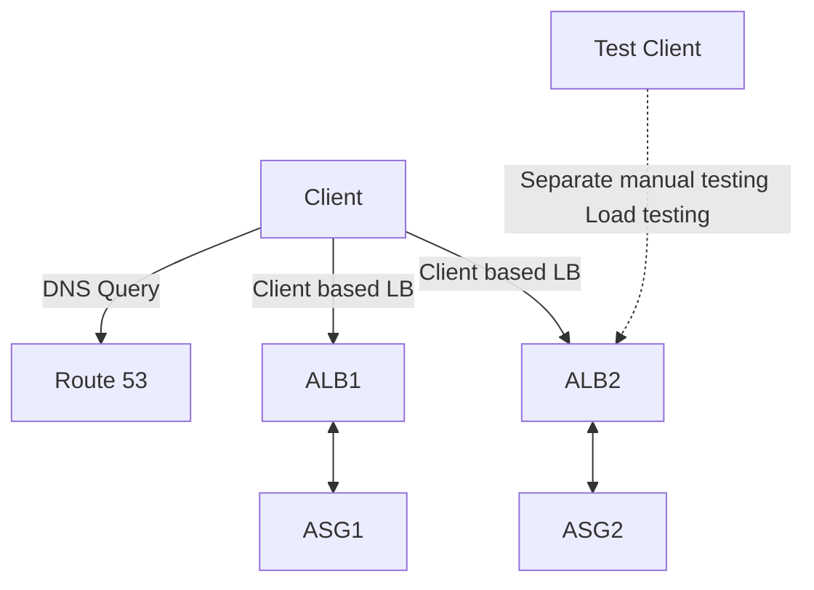

p 175
![[Solution-Architecture-on-AWS.png]]

# Solution Architecture on AWS
사용자가 응용 프로그램에 엑세스할 때 접속하는 순서

## 1. DNS Layer
* *Route 53*
## 2-1. CDN Layer
* *CloudFront*
- 정적 콘텐츠는 전 세계에 확산되고 CDN 계층, 콘텐츠 전송 네트워크를 통해 캐싱된다.
- CloudFront는 다음과 같은 방식으로 작동할 수 있다:
    1. **S3나 Glacier에서 정적 콘텐츠를 가져오기**: 기본 오리진 S3 사용
        
        일반적인 사용 사례이다. CloudFront는 S3 버킷이나 Glacier에 저장된 콘텐츠를 캐싱하여 전 세계 사용자에게 빠르게 제공한다.
        
        - User → CDN Layer → Static Assets Layer
    2. **사용자 지정 소스에서 콘텐츠 가져오기**: 커스텀 오리진 사용 → 동적 콘텐츠 전송에 사용
        
        사용자가 지정한 다른 서버나 데이터베이스에서 콘텐츠를 가져올 수 있습니다. 예를 들어, 사용자가 운영하는 웹 서버나 API 서버에서도 콘텐츠를 가져와 캐싱하고 배포할 수 있습니다.
## 2-1. Web Layer
- _CLB, ALB, NLB, API Gateway, Elastic IP_
- 웹 계층의 역할은 다음과 같다:

1. **사용자 요청 수신**: 사용자가 웹 브라우저나 모바일 앱을 통해 보낸 요청을 수신한다.
2. **동적 콘텐츠 처리**: 필요한 경우 동적인 콘텐츠를 처리한다.
3. **부하 분산 (Load Balancing)**: 여러 서버로 트래픽을 분산하여 특정 서버에 과부하가 걸리지 않도록 관리한다.
4. **요청 전달**: 수신한 요청을 컴퓨팅 계층으로 전달하여 실제 데이터 처리나 비즈니스 로직이 실행되도록 한다.
5. **응답 반환**: 컴퓨팅 계층에서 처리된 결과를 다시 사용자에게 반환한다.
* *EC2, ASG, Lambda, ECS, Fargate, Batch, EMR*
## 3. Compute Layer
- _EC2, ASG, Lambda, ECS, Fargate, Batch, EMR_

## 4-1. Caching / Sesstion Layer
- _ElastiCache, DAX, DynamoDB, RDS_

## 4-2. Database Layer
- _RDS, Aurora, DynamoDB ElasticSearch, S3, Redshift_

## 4-3. Decoupling Orchestration Layer
- _SQS, SNS, Kinesis Amazon MQ, Step Functions_

## 4-4. Storage Layer
- _EBS, EFS, Instance Store_

## 4-5. Static Assets Layer
- _(storage) S3, Glacier_


# III. High Performance Computing (HPC)
고성능 컴퓨팅(HPC)은 매우 복잡하고 계산 집약적인 작업을 수행하는 데 필요한 기술이다. 클라우드는 이러한 HPC 작업을 수행하기에 최적의 환경을 제공한다. 

## 클라우드에서 HPC의 이점

### 1. **즉각적인 리소스 생성**

- 클라우드는 필요할 때 순식간에 매우 많은 컴퓨팅 리소스를 생성할 수 있다.
- 물리적 하드웨어를 구매하고 설정하는 데 필요한 시간이 절약된다.

### 2. **확장성**

- 클라우드 환경에서는 필요한 만큼 리소스를 쉽게 확장할 수 있다.
- 추가 리소스를 활용하여 계산 시간을 단축하고 더 빠르게 결과를 도출할 수 있다.

### 3. **비용 효율성**

- 사용한 만큼만 비용을 지불하는 방식(Pay-as-you-go)으로, 리소스를 사용한 시간과 양에 따라 결제된다.
- 대규모 초기 투자 없이도 고성능 컴퓨팅을 활용할 수 있다.

### 4. **다양한 활용 분야**

- 클라우드 기반 HPC는 다양한 분야에서 활용될 수 있다:
    - **유전체학 (Genomics)**: 대규모 유전자 데이터 분석
    - **전산화학 (Computational Chemistry)**: 분자 모델링과 시뮬레이션
    - **재무위험 모델링 (Financial Risk Modeling)**: 복잡한 금융 모델 계산
    - **날씨 예측 (Weather Forecasting)**: 기상 데이터 분석 및 예측
    - **기계 학습 (Machine Learning)**: 대규모 데이터 셋을 활용한 모델 훈련
    - **딥 러닝 (Deep Learning)**: 신경망 모델의 훈련과 추론
    - **자율 주행 (Autonomous Driving)**: 자율 주행 차량의 시뮬레이션 및 데이터 처리

### 요약

고성능 컴퓨팅(HPC)은 클라우드에서 매우 효과적으로 수행될 수 있다. 클라우드는 즉각적인 리소스 생성, 뛰어난 확장성, 비용 효율성 등 많은 이점을 제공하며, 유전체학, 전산화학, 재무위험 모델링, 날씨 예측, 기계 학습, 딥 러닝, 자율 주행 등의 다양한 분야에서 활용될 수 있다. 클라우드 기반 HPC를 통해 복잡한 계산 작업을 더 빠르고 효율적으로 수행할 수 있다.


## HPC(고성능 컴퓨팅)를 수행하는 데 유용한 AWS 서비스

### 데이터 관리 및 전송

1. **AWS Direct Connect**:
    - 프라이빗 보안 네트워크를 통해 GB/s의 데이터를 클라우드로 이동.
2. **Snowball & Snowmobile**:
    - 대규모 데이터(PB 단위)를 클라우드로 이동.
3. **AWS DataSync**:
    - 온프레미스와 S3, EFS, FSx 간에 대용량 데이터를 이동. 특히 Windows 환경에서 유용.

### 컴퓨팅 및 네트워킹
<font color="#92d050">* 구분 중요</font>

1. **EC2 인스턴스**:
    
    - CPU 최적화, GPU 최적화 인스턴스 사용.
    - 비용 절감을 위한 Spot 인스턴스 / Spot Fleet + 자동 확장.
    - 네트워크 성능 향상을 위한 EC2 배치 그룹의 클러스터 사용.
    
2. **EC2 Enhanced Networking(EC2 향상된 네트워킹)(SR-IOV)**:
    
    - 더 높은 대역폭, 더 높은 PPS(Packet per second), 더 낮은 지연 시간 제공.
    - **EC2 Enhanced Networking이 가능한 이유**
	    1. **ENA(Elastic Network Adapter)**: 최대 100Gbps. EC2 개선을 위한 네트워킹으로 높은 대역폭을 제공하며, 초당 패킷이 높고 지연 시간이 낮다.
	    2. **Intel 82599 VF**: 최대 10Gbps(레거시). 인텔사에서 제공하는 오래된 ENA
	    
3.  **Elastic Fabric Adapter(EFA):** 

	* 고성능 컴퓨팅용 HPC 워크로드를 위해 향상된 ENA, Linux에서만 작동.
	* 노드 간 통신이나 밀접하게 결합된 작업이 유용. ex) 분산 연산
		* 이유 : MPI(Message Passing Interface) 표준 활용. 이 표준은 기본 Linux OS를 우회하여 지연 시간이 짧고 신뢰할 수 있는 안정적인 전송 제공.

### Storage (스토리지)

1. **Instance-attached storage (인스턴스 연결 스토리지)**:
    
    - **EBS**: io2 Block Express로 최대 256,000 IOPS 확장.
    - **Instance Store**: EC2 인스턴스와 연결되어 수백만 IOPS로 확장, 짧은 지연 시간.
    
2. **Network storage (네트워크 스토리지)**:
    
    - **Amazon S3**: 파일 시스템이 아닌 큰 블랍.
    - **Amazon EFS**: 전체 크기를 기준으로 IOPS 확장 또는 프로비저닝된 IOPS 사용.
    - **Lustre용 Amazon FSx**: HPC 최적화된 분산 파일 시스템, 수백만 IOPS, S3에 의해 지원됨.

### Automation and Orchestration (자동화 및 오케스트레이션)

1. **AWS Batch**:
    
    - 단일 실행이 가능한 다중 노드 병렬 작업을 지원.
    - 여러 EC2 인스턴스에 걸쳐 있는 작업을 쉽게 예약하고 실행 가능.
    
2. **AWS ParallelCluster (병렬 클러스터)**:
    
    - AWS에 HPC를 구축하기 위한 오픈 소스 클러스터 관리 툴.
    - 텍스트 파일로 구성할 수 있음.
    - VPC, 서브넷, 클러스터 유형 및 인스턴스 유형 생성 자동화.

이들 서비스를 활용하면 AWS에서 고성능 컴퓨팅 환경을 효율적으로 구축하고 관리할 수 있다.

# VI. Auto Scaling Groups

## Dynamic Scaling Policies
자동 스케일링 그룹(ASG)에서 동적 스케일링 정책은 다음과 같이 구성할 수 있다.

### Target Tracking Scaling (대상 추적 스케일링)

- **가장 간단하고 쉽게 설정 가능**:
    - 특정 지표를 목표로 설정하여 스케일링을 자동으로 관리한다.
    - 예: 평균 ASG CPU 사용률이 40%를 유지하도록 설정.

### Simple / Step Scaling (단순/단계 확장)

- **CloudWatch 경보를 기반으로 스케일링**:
    - 특정 조건이 충족되면 인스턴스를 추가하거나 제거한다.
    - 예: CPU 사용률이 70%를 초과하면 인스턴스 2개 추가.
    - 예: CPU 사용률이 30% 미만이면 인스턴스 1개 제거.

### Scheduled Actions (예약된 작업)

- **알려진 사용 패턴을 기반으로 스케일링**:
    - 특정 시간에 맞춰 자동으로 용량을 조절한다.
    - 예: 금요일 오후 5시에 최소 용량을 10으로 증가.

##  Predictive Policies
자동 스케일링 그룹(ASG)에서 예측 정책은 다음과 같이 구성할 수 있다.
### Predictive scaling (예측 스케일링)

- **지속적인 부하 예측 및 스케줄 스케일링 시간**:
    - 과거 데이터를 기반으로 향후 부하를 예측하여 스케일링 계획을 세운다.
    - 예: 특정 시간대에 예상되는 트래픽 증가에 대비해 미리 확장.

이러한 정책을 통해 AWS 환경에서 애플리케이션의 성능과 비용을 최적화할 수 있다. 필요에 따라 다양한 스케일링 정책을 조합하여 사용하면, 트래픽 변화에 유연하게 대응할 수 있다.


## Auto Scaling Groups(ASG)에서 확장하기에 적합한 주요 메트릭
자동 스케일링 그룹(ASG)에서 확장하기에 적합한 메트릭은 애플리케이션의 성능과 안정성을 보장하기 위해 중요하다. 

### CPU 사용률

- **CPUUtilization (평균 CPU 사용률)**:
    - 인스턴스 전체의 CPU 활용도를 모니터링한다.
    - 예: 평균 CPU 사용률이 70%를 초과하면 인스턴스를 추가하여 부하를 분산시킨다.

### RequestCountPerTarget

- **대상당요청수 RequestCountPerTarget**:
    - 각 대상(예: 로드 밸런서 뒤의 EC2 인스턴스)당 요청 수를 확인한다.
    - 예: 특정 인스턴스당 요청 수가 일정 임계값을 초과하면 인스턴스를 추가하여 요청을 처리한다.
    - 인스턴스가 안정적으로 작동하는 경우 유용하다.

### Average Network In / Out (평균 네트워크 입력/출력)

- **네트워크 입력/출력**:
    - 네트워크 바인딩된 응용 프로그램의 경우 네트워크 트래픽을 모니터링한다.
    - 예: 평균 네트워크 입력/출력 값이 특정 임계값을 초과하면 인스턴스를 추가한다.

### Any custom metric (사용자 지정 메트릭)

- **사용자 정의 메트릭**:
    - CloudWatch를 사용해 애플리케이션에 특화된 메트릭을 모니터링한다.
    - 예: 특정 애플리케이션 로그의 에러 발생 횟수, 메모리 사용량, 디스크 I/O 등.
    - 이러한 사용자 정의 메트릭을 기반으로 스케일링 정책을 설정할 수 있다.

이 메트릭들을 사용하여 자동 스케일링 정책을 설정하면, 애플리케이션의 성능과 안정성을 유지하면서 효율적으로 리소스를 관리할 수 있다. 다양한 메트릭을 조합하여 사용하면 보다 정교한 스케일링 정책을 구현할 수 있다.

## Auto Scaling Groups(ASG)의 중요한 사항
자동 스케일링(Auto Scaling) 그룹을 설정하거나 관리할 때 유용한 몇 가지 중요한 사항들이다.

### Spot Fleet support

- **Spot 및 On-Demand 인스턴스 혼합 사용**:
    - 비용 절감을 위해 Spot 인스턴스를 사용하면서도 안정성을 위해 On-Demand 인스턴스를 함께 사용할 수 있다.

### Lifecycle Hooks

- **인스턴스 라이프사이클 중 특정 작업 수행**:
    - 인스턴스가 서비스에 들어가기 전 또는 종료되기 전에 특정 작업을 수행할 수 있다.
    - 예: 클린업 작업, 로그 추출, 특별한 헬스 체크 등.

### AMI 업그레이드

- **런치 구성/템플릿 업데이트**:
    - AMI를 업그레이드하려면 런치 구성 또는 템플릿을 업데이트해야 한다.
    - 이후 기존 인스턴스를 수동으로 종료해야 하며, CloudFormation을 사용하여 이를 자동화할 수 있다.
    - 또는 EC2 Instance Refresh 기능을 사용하여 자동으로 인스턴스를 새로 고칠 수 있다.

이러한 기능들은 자동 스케일링 그룹의 유연성을 높이고 관리 작업을 간소화하는 데 매우 유용하다. Spot 인스턴스와 On-Demand 인스턴스를 혼합하여 비용을 절감할 수 있으며, Lifecycle Hooks를 통해 인스턴스의 라이프사이클 동안 필요한 작업을 자동으로 수행할 수 있다. 또한, EC2 Instance Refresh 기능을 사용하여 AMI 업그레이드를 보다 쉽게 관리할 수 있다.

## Auto Scaling 주요 기능

### Instance Refresh
EC2 Auto Scaling의 Instance Refresh 기능을 사용하면 인스턴스를 자동 새로고침으로, 최신 런치 템플릿을 적용할 수 있다. 이를 통해 시스템의 가용성과 안정성을 유지하면서 인스턴스를 업데이트할 수 있다. 다음은 Instance Refresh 기능을 설정하고 사용하는 방법에 대해 설명이다.

#### 목표
- 런치 템플릿을 업데이트한 후 모든 EC2 인스턴스를 재생성하는 것.

#### Instance Refresh 기능 사용
Instance Refresh 기능을 사용하면 수동으로 인스턴스를 종료하고 다시 시작할 필요 없이, 자동으로 인스턴스를 새로 고칠 수 있다.

#### 설정 방법

1. **최소 건강 비율(Minimum Healthy Percentage) 설정**:
    
    - 새로 고침 중에도 일정 비율의 인스턴스가 건강한 상태로 유지되도록 설정할 수 있다.
    - 예: 최소 건강 비율을 80%로 설정하면, 전체 인스턴스 중 80%는 항상 가용 상태로 유지된다.
2. **워밍업 시간(Warm-up Time) 지정**:
    
    - 새 인스턴스가 시작되고 실제로 사용 가능해질 때까지의 시간을 설정한다.
    - 예: 워밍업 시간을 300초(5분)로 설정하면, 새 인스턴스가 시작된 후 5분 동안은 트래픽을 받지 않고 준비 상태에 있게 된다.

#### 설정 예시

AWS Management Console 또는 AWS CLI를 통해 Instance Refresh를 설정할 수 있습니다.

##### AWS Management Console

1. Auto Scaling 그룹을 선택합니다.
2. "Instance Refresh" 탭으로 이동합니다.
3. "Start Instance Refresh" 버튼을 클릭합니다.
4. 최소 건강 비율과 워밍업 시간을 설정합니다.
5. 설정을 저장하고 새로 고침을 시작합니다.

##### AWS CLI

bash

```bash
aws autoscaling start-instance-refresh --auto-scaling-group-name <AutoScalingGroupName> --preferences '{"MinHealthyPercentage":<Percentage>,"InstanceWarmup":<TimeInSeconds>}'
```

- `<AutoScalingGroupName>`: Auto Scaling 그룹의 이름
- `<Percentage>`: 최소 건강 비율 (예: 80)
- `<TimeInSeconds>`: 워밍업 시간 (예: 300초)

##### 예시 설정

bash

```bash
aws autoscaling start-instance-refresh --auto-scaling-group-name MyAutoScalingGroup --preferences '{"MinHealthyPercentage":80,"InstanceWarmup":300}'
```

이 설정을 통해 런치 템플릿을 업데이트하고, 모든 인스턴스를 자동으로 새로 고칠 수 있다. 이를 통해 시스템의 가용성을 유지하면서, 최신 설정을 적용할 수 있다.

### Scaling Processes
Auto Scaling 그룹에서 다양한 스케일링 프로세스를 관리할 수 있다. 이 프로세스들을 이해하고 적절히 사용하면, 애플리케이션의 가용성과 안정성을 높일 수 있다. 다음은 주요 스케일링 프로세스와 그 기능에 대한 설명이다.

#### 주요 스케일링 프로세스

1. **Launch**: 새로운 EC2 인스턴스를 그룹에 추가하여 용량을 증가시킨다.
2. **Terminate**: 그룹에서 EC2 인스턴스를 제거하여 용량을 감소시킨다.
3. **HealthCheck**: 인스턴스의 상태를 점검한다. 상태가 불량한 인스턴스를 탐지한다.
4. **ReplaceUnhealthy**: 상태가 불량한 인스턴스를 종료하고, 새로 생성하여 교체한다.
5. **AZRebalance**: 가용 영역(AZ) 간에 EC2 인스턴스 수를 균형 있게 조정한다.
6. **AlarmNotification**: CloudWatch 경보를 수신하여 스케일링 작업을 트리거한다.
7. **ScheduledActions**: 사용자가 생성한 예약된 작업을 수행한다. 예를 들어, 특정 시간에 스케일링 작업을 실행할 수 있다.
8. **AddToLoadBalancer**: 인스턴스를 로드 밸런서 또는 타겟 그룹에 추가한다.
9. **InstanceRefresh**: 인스턴스를 새로 고친다. 새로운 런치 템플릿을 적용하여 인스턴스를 업데이트한다.

#### 프로세스 일시 중지

- 필요에 따라 특정 스케일링 프로세스를 일시 중지할 수 있습니다. 예를 들어, 특정 작업을 수행하는 동안 스케일링을 일시 중지하여 예기치 않은 인스턴스 추가/제거를 방지할 수 있습니다.

#### 일시 중지 방법

##### AWS Management Console

1. Auto Scaling 그룹을 선택합니다.
2. "Activity" 탭으로 이동합니다.
3. "Suspend" 또는 "Resume" 버튼을 클릭하여 특정 프로세스를 일시 중지 또는 재개한다.

##### AWS CLI

bash

```bash
aws autoscaling suspend-processes --auto-scaling-group-name <AutoScalingGroupName> --scaling-processes <ProcessName>
```

- `<AutoScalingGroupName>`: Auto Scaling 그룹의 이름
- `<ProcessName>`: 일시 중지할 프로세스 이름 (예: Launch, Terminate 등)

bash

```bash
aws autoscaling resume-processes --auto-scaling-group-name <AutoScalingGroupName> --scaling-processes <ProcessName>
```

- `<ProcessName>`: 재개할 프로세스 이름

##### 예시 설정

bash

```bash
aws autoscaling suspend-processes --auto-scaling-group-name MyAutoScalingGroup --scaling-processes Terminate
```

- 이 명령어는 `Terminate` 프로세스를 일시 중지하여 인스턴스가 그룹에서 제거되지 않도록 한다.

bash

```bash
aws autoscaling resume-processes --auto-scaling-group-name MyAutoScalingGroup --scaling-processes Terminate
```

- 이 명령어는 `Terminate` 프로세스를 다시 활성화하여 정상 작동하도록 한다.

이와 같은 스케일링 프로세스를 적절히 관리하여, Auto Scaling 그룹의 동작을 세밀하게 제어할 수 있다.

### Health Checks
Auto Scaling 그룹에서 인스턴스의 건강 상태를 확인하는 것은 매우 중요하다. 이를 위해 다양한 헬스 체크 옵션을 제공하며, 이를 통해 시스템의 안정성을 유지할 수 있다. 다음은 Auto Scaling 그룹에서 사용 가능한 헬스 체크 옵션과 그 기능에 대한 설명이다.

#### 헬스 체크 옵션

1. **EC2 Status Checks**:
    
    - EC2 인스턴스의 하드웨어 및 소프트웨어 상태를 점검한다.
    - EC2 인스턴스 자체에서 수행되는 기본적인 상태 점검이다.
2. **ELB Health Checks (HTTP)**:
    
    - ELB(Elastic Load Balancer)가 인스턴스의 상태를 점검한다.
    - HTTP 요청을 통해 인스턴스의 응답 상태를 확인한다.
    - 로드 밸런서를 사용하는 경우, ELB 헬스 체크를 통해 인스턴스의 가용성을 보장할 수 있다.
3. **Custom Health Checks**:
    
    - 사용자 정의 헬스 체크를 통해 인스턴스의 상태를 Auto Scaling 그룹에 전달할 수 있다.
    - AWS CLI 또는 AWS SDK를 사용하여 `set-instance-health` 명령을 통해 인스턴스의 상태를 설정한다.
    - 예를 들어, 특정 애플리케이션의 상태를 점검하여 헬스 체크 결과를 Auto Scaling 그룹에 반영할 수 있다.

#### 헬스 체크 동작 방식

- Auto Scaling 그룹은 불량한 상태로 판정된 인스턴스를 종료하고, 새로운 인스턴스를 시작하여 교체한다.
- 이를 통해 건강하지 않은 인스턴스가 지속적으로 운영되는 것을 방지하고, 시스템의 가용성을 유지한다.

#### 헬스 체크 설정 시 주의사항

- 단순하고 정확한 헬스 체크를 구성하는 것이 중요하다.
- 헬스 체크가 너무 복잡하거나 지나치게 엄격하면, 정상적인 인스턴스가 불량으로 판정될 수 있다.
- 반대로 헬스 체크가 너무 느슨하면, 실제로 불량한 인스턴스가 탐지되지 않을 수 있다.

#### 헬스 체크 설정 예시

###### EC2 Status Checks 및 ELB Health Checks 설정 (AWS Management Console)

1. Auto Scaling 그룹을 선택합니다.
2. "Details" 탭에서 "Health Check Type"을 선택한다.
3. EC2, ELB, 또는 둘 다 선택할 수 있다.
4. "Health Check Grace Period"를 설정하여 헬스 체크가 시작되기 전에 대기할 시간을 지정한다.

##### Custom Health Checks 설정 (AWS CLI)

1. 사용자 정의 스크립트를 통해 인스턴스 상태를 점검한다.
2. 인스턴스 상태를 설정합니다.

bash

```bash
aws autoscaling set-instance-health --instance-id <InstanceId> --health-status <HealthStatus>
```

- `<InstanceId>`: 인스턴스 ID
- `<HealthStatus>`: `Healthy` 또는 `Unhealthy`

##### 예시 설정

bash

```bash
aws autoscaling set-instance-health --instance-id i-0123456789abcdef0 --health-status Unhealthy
```

- 이 명령어는 지정된 인스턴스를 불량 상태로 설정한다. Auto Scaling 그룹은 이 인스턴스를 종료하고 새 인스턴스를 시작한다.

적절한 헬스 체크 설정을 통해 Auto Scaling 그룹에서 인스턴스의 상태를 지속적으로 모니터링하고, 불량한 인스턴스를 자동으로 교체하여 시스템의 안정성을 유지할 수 있다.

### Auto Scaling Update Strategies #ComputeAndLoadBalancingJeongAh

Auto Scaling 그룹에서 응용 프로그램을 업데이트하는 방법의 예시는 다음과 같다.

1. **자동 배율 그룹 유지 및 업데이트**
    
    - <u>기존 자동 배율 그룹을 유지</u>하면서 <u>같은 타겟 그룹</u>에 새 런치 템플릿을 만든다.
    - 새 템플릿으로 EC2 인스턴스를 생성하고, 이를 위해 자동 스케일링 그룹 용량을 일시적으로 늘린니다.
    - 애플리케이션 부하 분산기를 통해 두 가지 버전의 애플리케이션에 트래픽을 분산한다.
    - 새 버전이 안정적이라면 기존 인스턴스를 종료한다.

2. **새 자동 배율 그룹 생성**
    
    - <u>새로운 자동 배율 그룹을 생성</u>하고, <u>새 타깃 그룹</u>도 만든다.
    - 두 번째 타깃 그룹에 소량의 트래픽을 보내 새 애플리케이션을 테스트한다.
    - 테스트가 성공적이라면 트래픽을 점진적으로 새 그룹으로 전환하고, 기존 그룹을 제거한다.
    
3. **이중 ALB 설정**
    
    - <u>기존 ALB와 새로운 ALB를 각각 다른 자동 배율 그룹과 연결</u>한다.
    - Route 53을 사용해 클라이언트 트래픽을 두 ALB로 분산한다.
    - 새로운 ALB를 독립적으로 테스트하고 점진적으로 트래픽을 전환한다.
    
### Auto Scaling - Solution Architecture 

1.  Same target group
	 기존 운영 EC2 instance를 똑같이 하나 더 만들어서 동일한 ASG 안에 두는 것
	 동일 ASG에 있으므로 ALB에 의해 모두에게 트레픽이 분산된다.  
2. Target group 1,2, ... ,N
	: ASG 그룹을 여러개 만들고 ELB는 하나로 구성. 새롭게 만든 두번째 ASG에 트래픽을 테스트하듯이 ALB를 이용해서 조금씩 보내는 게 가능함.

3. ALB단 부터 새롭게 만듬 Route 53 구성방식

   3-1. Client 가 요청한 DNS Query를 Route 53 에 의해서 처리할때 어떤 ALB에 대한 주소를 클라이언트에게 알려줄지를 정한다 = Client Based LB 
   새롭게 만든 ALB2에 네트워크 트래픽을 점차 늘려나가는 방식으로 테스트 가능함 
   3-2. 53 레벨에서 서비스하기 전에 <font color="#de7802">독립적으로 부하 테스트를 할 수 있음. </font>

# V. Spot Instances & Spot Fleet
## EC2 Spot Instances

* 온디맨드 인스턴스에 비해 최대 90% 할인 가능
* 최대 스팟 가격을 정의하고 현재 스팟 가격이 최대 가격보다 낮을 때 인스턴스 획득
* 시간당 스팟 가격은 수요와 용량에 따라 변동
* 현재 스팟 가격이 최대 가격을 초과할 경우, 인스턴스를 중지하거나 종료할 수 있으며 2분의 유예 기간 제공
* 배치 작업, 데이터 분석 또는 실패에 견딜 수 있는 작업에 사용
* 중요한 작업이나 데이터베이스에는 적합하지 않음

## Spot Fleets(스팟 플릿)
* 스팟 플릿 = 스팟 인스턴스 세트 + (선택 사항) 온디맨드 인스턴스
* 스팟 플릿은 가격 제약 조건 내에서 목표 용량을 충족하려고 시도
* 가능한 런치 풀 정의: 인스턴스 유형(m5.large), 운영체제(OS), 가용 영역(Availability Zone)
* 여러 런치 풀을 가질 수 있어 플릿이 선택 가능
* 용량 또는 최대 비용에 도달하면 스팟 플릿은 인스턴스 실행을 중지
* **스팟 인스턴스 할당 전략**:
	- lowestPrice: 가장 낮은 가격의 풀에서 (비용 최적화, 짧은 작업)
	- diversified: 모든 풀에 분산 (가용성에 좋음, 긴 작업)
	- capacityOptimized: 인스턴스 수에 대해 최적 용량을 가진 풀
	- priceCapacityOptimized (권장): 가장 높은 용량을 가진 풀에서, 그 후 가장 낮은 가격의 풀 선택 (대부분의 작업에 최적), 스팟 플릿을 통해 가장 낮은 가격의 스팟 인스턴스를 자동으로 요청 가능

## EC2 Spot Instances와 Spot Fleets의 차이점
### EC2 Spot Instances

- **단일 인스턴스**: 스팟 인스턴스는 단일 EC2 인스턴스를 요청하는 방식이다.
- **가격 최적화**: 사용자는 스팟 인스턴스에 대해 지불할 최대 가격을 설정하고, 현재 스팟 가격이 이에 미치지 못하면 인스턴스를 획득할 수 있다.
- **유연성**: 스팟 인스턴스는 주로 비용 절감과 일시적인 작업에 사용된다. 예를 들어, 배치 작업, 데이터 분석, 테스트 환경 등 실패에 견딜 수 있는 작업에 적합하다.
- **관리**: 사용자는 각 인스턴스를 개별적으로 관리해야 한다. 더 싼 인스턴스가 나오면 직접 바꿔야함(수동관리)

### Spot Fleets)

- **다중 인스턴스 관리**: 스팟 플릿은 여러 스팟 인스턴스와 선택적으로 온디맨드 인스턴스를 포함하는 인스턴스 집합을 관리하는 방식이다.
- **자동화 및 최적화**: 스팟 플릿은 목표 용량을 설정하고, 가격 제약 조건 내에서 이를 충족하려고 시도한다. 다양한 인스턴스 유형, 운영 체제, 가용 영역을 포함한 다양한 런치 풀을 정의할 수 있어 더 높은 유연성과 가용성을 제공한다.
- **할당 전략**: 스팟 플릿은 여러 할당 전략을 제공한다. 예를 들어, lowestPrice, diversified, capacityOptimized, priceCapacityOptimized 등 다양한 전략을 통해 비용 최적화, 가용성, 용량 최적화를 달성할 수 있다.
- **자동 확장**: 스팟 플릿은 자동 확장 기능을 지원하여, 특정 조건에 따라 인스턴스를 자동으로 늘리거나 줄일 수 있다.
- **단일 관리**: 스팟 플릿은 하나의 엔티티로 취급되어, 복수의 인스턴스를 중앙에서 관리할 수 있다.

### 요약

- **EC2 스팟 인스턴스**: 단일 인스턴스를 저렴한 가격에 사용하고자 할 때 적합.
- **스팟 플릿**: 다중 인스턴스를 자동으로 관리하고, 다양한 인스턴스 유형과 전략을 통해 비용 절감과 가용성을 극대화하고자 할 때 적합.


# VI. Amazon ECS - Elastic Container Service
Docker는 컨테이너 기술의 핵심을 제공하고, ECS는 이러한 Docker 컨테이너를 대규모로 관리하고 오케스트레이션하는 데 사용되는 서비스이다.

## Docker
- **소프트웨어 개발 플랫폼**: Docker는 앱을 배포하고 관리하는 소프트웨어 개발 플랫폼이다.
- **컨테이너 기반**: Docker는 애플리케이션을 모든 OS에서 실행할 수 있는 컨테이너에 포장하여 배포한다.
- **일관된 실행 환경**: 애플리케이션은 실행 위치에 관계없이 동일한 환경에서 실행된다.
- **시스템 호환성 문제 해결**: 모든 시스템에서 호환성 문제 없이 예측 가능한 동작을 보인다.
- **작업량 감소**: 개발, 테스트, 배포 과정에서의 작업량을 줄여준다.
- **유지보수 및 구축 용이**: 애플리케이션의 유지보수 및 구축이 용이하다.
- **언어/OS/기술 무관**: 모든 프로그래밍 언어, 운영 체제, 기술과 함께 작동한다.
- **자원 제어**: 컨테이너에 할당되는 메모리와 CPU 양을 제어할 수 있다.
- **빠른 확장성**: 컨테이너를 매우 빠르게 위아래로 확장할 수 있다(초 단위).
- **효율성**: 가상 머신보다 더 효율적으로 자원을 사용한다.

### Docker의 주요 특징

1. **컨테이너(Container)**:
    
    - 컨테이너는 애플리케이션과 그 실행 환경을 함께 캡슐화하여, 어디서나 일관되게 실행될 수 있도록 한다.
    - 가볍고, 빠르게 시작할 수 있으며, 시스템 자원을 효율적으로 사용한다.
2. **이미지(Image)**:
    
    - Docker 이미지는 컨테이너의 실행 환경을 정의하는 템플릿이다.
    - 이미지는 불변이며, 동일한 이미지를 사용하면 항상 동일한 실행 환경을 보장한다.
3. **도커 허브(Docker Hub)**:
    
    - Docker Hub는 Docker 이미지를 저장하고 공유할 수 있는 클라우드 기반 레지스트리이다.
    - 다양한 공식 이미지와 커뮤니티 이미지를 제공하여, 쉽게 애플리케이션을 시작할 수 있다.
4. **도커 파일(Dockerfile)**:
    
    - Dockerfile은 이미지를 빌드하기 위한 명령어 모음이다.
    - 코드와 의존성을 정의하고, 이미지를 자동으로 생성할 수 있다.

### Docker의 장점

- **이식성**: 컨테이너를 사용하면 애플리케이션을 개발 환경에서 프로덕션 환경으로 쉽게 이동할 수 있다.
- **효율성**: 가상 머신보다 더 적은 자원을 사용하며, 빠르게 시작할 수 있다.
- **유연성**: 다양한 언어와 프레임워크 지원, 여러 클라우드 플랫폼에서 사용 가능하다.
- **자동화**: CI/CD 파이프라인에 쉽게 통합하여 자동화된 배포와 테스트가 가능다.

## AWS의 Docker Containers 관리
AWS는 다양한 요구에 맞춰 여러 컨테이너 관리 옵션을 제공하여, 사용자가 필요에 따라 적합한 서비스를 선택할 수 있게 한다.
### Amazon Elastic Container Service (Amazon ECS)

- Amazon ECS는 완전 관리형 컨테이너 오케스트레이션 서비스로, AWS 환경에서 Docker 컨테이너를 쉽게 실행하고 확장할 수 있다.
- **특징**:
    - AWS와 긴밀하게 통합되어 있어 높은 가용성과 보안성을 제공한다.
    - EC2 인스턴스 또는 AWS Fargate를 사용하여 컨테이너를 실행할 수 있다.
    - 사용이 간편하고, AWS의 다른 서비스와 원활하게 연동된다.

### Amazon Elastic Kubernetes Service (Amazon EKS)

- Amazon EKS는 Kubernetes를 관리하고 오케스트레이션하는 서비스로, AWS에서 Kubernetes 클러스터를 손쉽게 운영할 수 있다.
- **특징**:
    - 오픈 소스 Kubernetes와 완벽하게 호환된다.
    - 자동화된 업그레이드, 패치 관리, 고가용성을 제공한다.
    - EC2 인스턴스 또는 AWS Fargate를 사용하여 컨테이너를 실행할 수 있다.

### AWS Fargate

- AWS Fargate는 서버리스 컨테이너 실행 환경으로, 인프라를 관리할 필요 없이 컨테이너를 실행할 수 있다.
- **특징**:
    - 서버리스로 인프라 관리 부담이 없다.
    - ECS 및 EKS와 통합되어 사용 가능하다.
    - 자동으로 스케일링되며, 사용한 만큼만 비용을 지불한다.

### ECS 및 EKS 작업

- ECS와 EKS를 통해 각각의 작업(Task)을 정의하고 실행할 수 있다.
- **특징**:
    - ECS 작업: 특정 컨테이너 이미지를 기반으로 작업을 정의하고, 이를 클러스터 내에서 실행한다.
    - EKS 작업: Kubernetes의 Pod를 기반으로 작업을 정의하고, 이를 클러스터 내에서 실행한다.

### 요약

- **Amazon ECS**: AWS에서 Docker 컨테이너를 관리하고 오케스트레이션하는 완전 관리형 서비스.
- **Amazon EKS**: Kubernetes 기반의 컨테이너 오케스트레이션 서비스로, AWS 환경에서 Kubernetes 클러스터를 운영.
- **AWS Fargate**: 서버리스 컨테이너 실행 환경으로, 인프라 관리 없이 컨테이너 실행.
- **ECS 및 EKS 작업**: 각각의 환경에서 작업을 정의하고 실행하는 방식.

## Amazon ECS – 사용 사례
### 1. 마이크로서비스 실행

- **설명**: ECS는 마이크로서비스 아키텍처를 지원하여 애플리케이션을 작은 독립적인 서비스로 분할하여 실행할 수 있다.
- **특징**:
    - 각 마이크로서비스는 독립적으로 배포 및 확장 가능하다.
    - 서비스 간의 통신을 쉽게 관리할 수 있다.
#### 마이크로서비스 실행 사례

1. **한 컴퓨터에서 여러 Docker 컨테이너 실행**
    
    - **설명**: Amazon ECS는 단일 EC2 인스턴스에서 여러 Docker 컨테이너를 실행할 수 있게 한다. 이를 통해 자원을 효율적으로 사용하고 비용을 절감할 수 있다.
    - **예시**: 예를 들어, 하나의 EC2 인스턴스에서 사용자 인증 서비스, 데이터 처리 서비스, 로그 수집 서비스 등 여러 마이크로서비스를 각각의 Docker 컨테이너로 실행할 수 있다.
2. **마이크로서비스 사이의 통신 강화**
    
    - **설명**: Amazon ECS는 서비스 디스커버리 기능을 제공하여 마이크로서비스 간의 통신을 쉽게 설정하고 관리할 수 있다.
    - **예시**: 사용자 인증 서비스가 데이터 처리 서비스와 통신할 때, ECS의 서비스 디스커버리 기능을 사용하여 서로의 위치를 쉽게 찾고 통신을 할 수 있다. 이를 통해 마이크로서비스 간의 통신이 강화된다.
3. **응용 프로그램 부하 분산기와 네트워크 부하 분산기의 통합**
    
    - **설명**: Amazon ECS는 Application Load Balancer(ALB)와 Network Load Balancer(NLB)와 직접 통합할 수 있어, 트래픽을 효과적으로 분산할 수 있다.
    - **예시**: 여러 사용자로부터의 요청을 ALB가 받아서 각각의 마이크로서비스 컨테이너로 분산시켜 처리한다. 이를 통해 트래픽의 균형을 맞추고 서비스의 가용성과 성능을 높일 수 있다.
4. **자동 스케일링 기능**
    
    - **설명**: Amazon ECS는 자동 스케일링 기능을 제공하여 트래픽 변화에 따라 컨테이너 수를 자동으로 조정할 수 있다.
    - **예시**: 특정 시간대에 트래픽이 증가할 경우 ECS가 자동으로 더 많은 컨테이너를 실행하여 처리 능력을 확장하고, 트래픽이 줄어들면 불필요한 컨테이너를 종료하여 비용을 절감한다.

### 2. 단일 머신에서 여러 Docker 컨테이너 실행

- **설명**: 한 대의 EC2 인스턴스에서 여러 Docker 컨테이너를 실행하여 자원을 효율적으로 사용할 수 있니다.
- **특징**:
    - 리소스 사용을 최적화하여 비용 절감.
    - 애플리케이션의 격리성과 관리 용이성 증가.

### 3. 쉬운 서비스 디스커버리

- **설명**: ECS는 내장된 서비스 디스커버리 기능을 제공하여 컨테이너 간의 통신을 쉽게 설정하고 관리할 수 있다.
- **특징**:
    - DNS 기반 서비스 디스커버리.
    - AWS Cloud Map과 통합.

### 4. 애플리케이션 로드 밸런서 및 네트워크 로드 밸런서와 직접 통합

- **설명**: ECS는 Application Load Balancer(ALB)와 Network Load Balancer(NLB)와 통합되어 트래픽 분산을 쉽게 설정할 수 있다.
- **특징**:
    - 트래픽 관리와 분산을 자동화.
    - 고가용성과 확장성 제공.

### 5. 자동 스케일링 기능

- **설명**: ECS는 컨테이너의 자동 스케일링을 지원하여 트래픽 변화에 따라 자동으로 리소스를 조정할 수 있다.
- **특징**:
    - 수요에 따라 컨테이너 수를 자동으로 조정.
    - 비용 최적화와 성능 보장.

### 6. 배치 처리 및 예약 작업 실행

- **설명**: ECS는 배치 처리와 예약 작업을 쉽게 관리할 수 있다.
- **특징**:
    - 정기적인 작업을 예약하여 실행 가능.
    - 대규모 데이터 처리 작업에 적합.

### 7. 온디맨드, 예약, 스팟 인스턴스에서 ECS 작업 실행

- **설명**: ECS는 다양한 인스턴스 유형(On-demand, Reserved, Spot)을 지원하여 비용 효율적인 인프라 운영이 가능히다.
- **특징**:
    - 비용 절감과 유연한 리소스 사용.

### 8. 애플리케이션의 클라우드로의 마이그레이션

- **설명**: 기존 애플리케이션을 클라우드로 마이그레이션하여 관리와 확장성을 향상시킬 수 있다.
- **특징**:
    - 기존 인프라에서 클라우드로의 원활한 이전.
    - 클라우드 네이티브 기능 활용.

### 9. 레거시 애플리케이션을 Dockerize하여 클라우드로 이전

- **설명**: 온프레미스에서 실행 중인 레거시 애플리케이션을 Docker 컨테이너로 변환하여 ECS에서 실행할 수 있다.
- **특징**:
    - 애플리케이션 현대화.
    - 관리와 배포 간소화.

### 10. Docker 컨테이너를 Amazon ECS로 이전

- **설명**: 기존에 Docker를 사용 중인 애플리케이션을 Amazon ECS로 이동하여 관리 효율성을 높일 수 있다.
- **특징**:
    - AWS의 관리형 서비스 활용.
    - 확장성과 가용성 증가.

## Amazon ECS 주요 개념

1. **ECS Cluster**: EC2 인스턴스의 논리적 그룹화
    
    - **설명**: EC2 인스턴스의 논리적 그룹으로, 컨테이너가 배포되고 관리되는 단위이다.
    - **예시**: 여러 EC2 인스턴스를 하나의 클러스터로 묶어, 그 클러스터 안에서 컨테이너를 배포하고 관리한다.
2. **ECS Service**: 실행해야 할 태스크 수와 실행 방법을 정의
    
    - **설명**: 특정 수의 태스크를 항상 실행 상태로 유지하도록 정의한다. 서비스는 로드 밸런서를 사용해 트래픽을 분산시킬 수도 있다.
    - **예시**: 웹 애플리케이션 서비스가 항상 3개의 태스크를 실행하도록 설정하여 가용성을 유지한다.
3. **Task Definitions**: Docker 컨테이너 실행 방법을 ECS에 알려주는 JSON 형태의 메타데이터
    
    - **설명**: Docker 컨테이너를 어떻게 실행할지를 정의하는 JSON 형태의 메타데이터이다. 이미지 이름, CPU, RAM, 네트워크 설정 등을 포함한다.
    - **예시**: 웹 서버 컨테이너를 정의하는 Task Definition에는 Nginx 이미지, 512MB RAM, 1vCPU 등의 정보가 포함될 수 있다.
4. **ECS Task**: 작업 정의 인스턴스, 실행 중인 도커 컨테이너
    
    - **설명**: Task Definition에 따라 실행되는 컨테이너의 인스턴스이다. 실행 중인 도커 컨테이너를 나타낸다.
    - **예시**: 하나의 Task는 Nginx 웹 서버 컨테이너가 실제로 EC2 인스턴스에서 실행되는 것을 의미한다.
5. **ECS IAM Roles**:
    
    - **설명**: ECS에서 특정 역할을 수행할 수 있도록 권한을 부여하는 IAM 역할이다. 주로 ECS 클러스터와 연관된 역할이다.
    - **예시**: ECS 클러스터가 S3 버킷에 접근할 수 있도록 하는 IAM 역할이 설정될 수 있습니다.
    
	5-1. **EC2 Instance Profile (인스턴스 프로파일)**:
    - **설명**: EC2 인스턴스에서 사용되는 IAM 역할로, ECS로 API 호출, 로그 전송 등의 작업을 수행할 수 있도록 권한을 부여한다.
    - **예시**: EC2 인스턴스가 ECS API를 호출하여 클러스터 상태를 업데이트하거나 CloudWatch에 로그를 전송할 수 있다.
	5-2. **ECS Task IAM Role**: 
    - **설명**: 각 작업(Task)이 특정 역할을 수행할 수 있도록 하는 IAM 역할이다. 주로 작업 내에서 AWS 리소스에 접근할 수 있도록 권한을 부여한다.
    - **예시**: 특정 Task가 S3 버킷에서 파일을 읽거나 DynamoDB 테이블에 데이터를 쓸 수 있도록 하는 IAM 역할이 설정될 수 있다.

## Application Load Balancer(ALB) Integration
Amazon ECS와 Application Load Balancer(ALB)의 통합은 매우 유용한 기능들을 제공한다. 아래에 주요 포인트와 사용 사례이다.

### Amazon ECS와 ALB 통합의 주요 포인트

1. **동적 포트 매핑**:
    
    - **설명**: 동적 포트 매핑을 통해, ECS는 각 컨테이너 인스턴스에 고유한 포트를 할당할 수 있다. 이는 동일한 EC2 인스턴스에서 여러 컨테이너가 실행될 때 유용하다.
    - **예시**: 컨테이너 A는 포트 32768, 컨테이너 B는 포트 32769 등으로 할당될 수 있다.
2. **동일한 EC2 인스턴스에서 동일한 애플리케이션의 여러 인스턴스를 실행 가능**:
    
    - **설명**: 동적 포트 매핑을 통해 동일한 EC2 인스턴스에서 동일한 애플리케이션의 여러 인스턴스를 실행할 수 있다. 이는 리소스 활용도를 극대화한다.
    - **예시**: 하나의 EC2 인스턴스에서 여러 인스턴스의 웹 서버 컨테이너가 서로 다른 포트로 실행될 수 있다.
3. **ALB가 EC2 인스턴스에서 올바른 포트를 찾음**:
    
    - **설명**: ALB는 동적 포트 매핑을 사용하여 각 컨테이너의 올바른 포트를 자동으로 감지하고 트래픽을 해당 포트로 라우팅한다.
    - **예시**: ALB는 요청을 받아 적절한 컨테이너 인스턴스의 동적 포트로 트래픽을 전달한다.

### 사용 사례

1. **EC2 인스턴스 하나에서 실행되는 경우에도 복원력 향상**:
    
    - **설명**: 여러 컨테이너 인스턴스가 동일한 EC2 인스턴스에서 실행될 수 있어 단일 인스턴스 장애 시에도 서비스 복원력이 향상된다.
    - **예시**: 하나의 EC2 인스턴스에서 여러 애플리케이션 인스턴스가 실행되므로, 한 인스턴스가 실패해도 다른 인스턴스가 계속 작동한다.
2. **CPU/코어 활용도 극대화**:
    
    - **설명**: 동일한 EC2 인스턴스에서 여러 컨테이너를 실행함으로써 CPU와 메모리 자원을 최대한 활용할 수 있다.
    - **예시**: 고성능 EC2 인스턴스를 사용하여 여러 컨테이너를 실행하면 자원 활용도를 최적화할 수 있다.
3. **애플리케이션 가동 시간에 영향을 주지 않고 롤링 업그레이드를 수행할 수 있는 기능**:
    
    - **설명**: ALB 통합을 통해 롤링 업그레이드를 수행할 때, 기존 컨테이너를 점진적으로 교체하여 애플리케이션 가동 시간에 영향을 주지 않는다.
    - **예시**: 새로운 버전의 컨테이너를 배포할 때, ALB는 새로운 컨테이너가 준비되면 트래픽을 전환하여 무중단 업그레이드를 실현한다.

이와 같은 Amazon ECS와 ALB의 통합은 애플리케이션의 복원력, 자원 활용도, 그리고 무중단 배포를 가능하게 하여 운영 효율성을 크게 향상시킨다.

## AWS Fargate
AWS Fargate는 인프라 프로비저닝 없이 Docker 컨테이너를 AWS에서 실행할 수 있는 서버리스 컴퓨팅 엔진이다. 

### AWS Fargate의 주요 특징

1. **Docker 컨테이너 실행**:
    
    - **설명**: Fargate를 사용하면 AWS에서 직접 Docker 컨테이너를 실행할 수 있다.
    - **예시**: Docker 이미지를 정의하고 이를 AWS Fargate로 배포하여 애플리케이션을 실행한다.
2. **인프라 프로비저닝 불필요**:
    
    - **설명**: Fargate는 EC2 인스턴스를 관리할 필요 없이 컨테이너를 실행할 수 있다.
    - **예시**: EC2 인스턴스를 설정하거나 관리할 필요 없이 Fargate가 모든 인프라를 관리한다.
3. **서버리스**:
    
    - **설명**: Fargate는 완전한 서버리스 환경을 제공하여 인프라 관리의 부담을 덜어준다.
    - **예시**: 서버 관리 없이 애플리케이션의 배포와 확장이 가능하다.
4. **태스크 정의 생성**:
    
    - **설명**: Fargate에서 컨테이너를 실행하기 위해서는 태스크 정의를 생성해야 한다.
    - **예시**: 태스크 정의에는 컨테이너 이미지, 필요한 CPU 및 메모리, 네트워크 설정 등이 포함된다.
5. **CPU 및 RAM 기반 컨테이너 실행**:
    
    - **설명**: Fargate는 사용자가 필요한 CPU와 RAM에 따라 컨테이너를 실행해 준다.
    - **예시**: 특정 애플리케이션이 필요한 자원 요구 사항에 맞춰 Fargate가 적절한 리소스를 할당한다.
6. **확장성**:
    
    - **설명**: 태스크 수를 증가시키는 것만으로도 손쉽게 확장할 수 있습니다. 더 이상 EC2 인스턴스를 추가할 필요가 없다.
    - **예시**: 서비스 트래픽이 증가할 때 태스크 수를 늘려 자동으로 확장하고, 트래픽 감소 시 태스크 수를 줄여 비용을 절감할 수 있다.

### 사용 사례

1. **빠른 애플리케이션 배포**:
    
    - **설명**: 인프라 설정 없이 빠르게 애플리케이션을 배포할 수 있다.
    - **예시**: 개발 및 테스트 환경에서 새로운 애플리케이션 버전을 신속하게 배포하여 테스트할 수 있다.
2. **자동 확장**:
    
    - **설명**: 트래픽 변화에 따라 자동으로 태스크 수를 조절하여 애플리케이션을 확장할 수 있다.
    - **예시**: 이벤트나 프로모션 기간 동안 트래픽이 급증할 때 자동으로 스케일 아웃하여 사용자 경험을 유지한다.
3. **비용 효율성**:
    
    - **설명**: 필요한 리소스만큼만 사용하므로 비용을 절감할 수 있다.
    - **예시**: 사용량에 따라 자동으로 리소스를 할당하고 해제하여 오버프로비저닝을 방지한다.

AWS Fargate는 서버 관리의 부담을 덜어주고, 유연한 리소스 관리와 확장성을 제공함으로써 애플리케이션 배포와 운영을 단순화한다. 이를 통해 개발자는 인프라 관리보다는 애플리케이션 코드에 더 집중할 수 있다.

## Amazon ECS – Security & Networking
Amazon ECS(Elastic Container Service)는 보안 및 네트워킹 측면에서 다양한 기능을 제공한다.
### Amazon ECS 보안 및 네트워킹

#### 1. 비밀 및 구성 관리
- **환경 변수 주입**:
  - **설명**: 실행 중인 도커 컨테이너에 비밀 정보나 구성을 환경 변수로 주입할 수 있다.
  - **예시**: 데이터베이스 비밀번호나 API 키를 환경 변수로 설정하여 컨테이너 내에서 안전하게 사용할 수 있다.

- **SSM 파라미터 스토어 및 시크릿 매니저 통합**:
  - **설명**: AWS SSM(Parameter Store)과 AWS Secrets Manager를 사용하여 비밀 정보를 안전하게 저장하고 관리할 수 있다.
  - **예시**: 애플리케이션 실행 시 SSM Parameter Store나 Secrets Manager에서 비밀 정보를 가져와 환경 변수로 설정한다.

#### 2. ECS 작업 네트워킹
ECS에서 네트워크 모드를 설정하여 컨테이너 네트워킹을 구성할 수 있습니다. 

- **none**:
  - **설명**: 네트워크 연결이 없으며, 포트 매핑도 지원되지 않는다.
  - **사용 사례**: 네트워크 연결이 필요 없는 단순한 작업에 유용하다.

- **bridge**:
  - **설명**: Docker의 가상 컨테이너 기반 네트워크를 사용한다.
  - **사용 사례**: 여러 컨테이너가 동일한 호스트에서 통신해야 할 때 유용하다.

- **host**:
  - **설명**: Docker의 네트워크를 우회하고 기본 호스트 네트워크 인터페이스를 사용한다.
  - **사용 사례**: 높은 성능이 필요하거나, 호스트와 동일한 네트워크 환경을 공유해야 할 때 유용하다.

- **awsvpc**:
  - **설명**: 각 작업이 자체 ENI(Elastic Network Interface)와 개인 IP 주소를 받는다.
  - **사용 사례**: Fargate 태스크의 기본 모드로, 단순화된 네트워킹, 강화된 보안, 보안 그룹, 모니터링, VPC 흐름 로그를 제공한다.

#### 3. awsvpc 모드의 이점
- **자체 ENI 및 개인 IP 주소**:
  - **설명**: 각 작업이 고유한 ENI와 IP 주소를 받으므로 네트워크 격리와 보안이 강화된다.
  - **예시**: 각 작업이 별도의 네트워크 인터페이스를 사용하여 다른 작업과 독립적으로 통신한다.

- **단순화된 네트워킹**:
  - **설명**: 네트워크 설정이 간소화되어 관리가 용이하다.
  - **예시**: VPC 내에서의 네트워크 설정이 간단하여, 추가적인 네트워크 구성이 필요 없다.

- **강화된 보안**:
  - **설명**: 보안 그룹을 통해 네트워크 트래픽을 제어할 수 있다.
  - **예시**: 각 작업에 맞춤형 보안 그룹을 적용하여 트래픽을 필터링하고 제어한다.

- **모니터링 및 VPC 흐름 로그**:
  - **설명**: VPC 흐름 로그를 사용하여 네트워크 트래픽을 모니터링할 수 있다.
  - **예시**: 네트워크 트래픽 분석을 통해 보안을 강화하고, 문제 발생 시 원인을 신속히 파악할 수 있다.

Amazon ECS는 이러한 보안 및 네트워킹 기능을 통해 컨테이너화된 애플리케이션을 안전하게 배포하고 관리할 수 있도록 지원한다. 이를 통해 사용자는 애플리케이션의 보안과 네트워킹을 보다 효율적으로 관리할 수 있다. 

## Amazon ECS – Service Auto Scaling
Amazon ECS(Elastic Container Service)의 서비스 자동 확장은 애플리케이션의 수요 변화에 따라 작업 수를 자동으로 조정하여 효율적이고 유연한 리소스 관리를 제공한다. 

### 1. 자동 확장의 개요
- **설명**: Amazon ECS는 AWS 애플리케이션 자동 확장 기능을 활용하여 원하는 작업 수를 자동으로 증가 또는 감소시킨다.
- **예시**: 애플리케이션의 트래픽이 증가하면 자동으로 작업 수를 늘려 처리 용량을 확장하고, 트래픽이 줄어들면 작업 수를 줄여 비용을 절감한다.

### 2. ECS 서비스 수준에서의 모니터링
- **설명**: ECS 서비스는 CloudWatch를 통해 CPU 및 RAM 사용량을 추적한다.
- **예시**: CloudWatch 메트릭을 사용하여 현재 리소스 사용량을 모니터링하고, 이를 기반으로 자동 확장 정책을 설정할 수 있다.

### 3. 다양한 자동 확장 전략
- **목표 추적(Target Tracking)**:
  - **설명**: 특정 CloudWatch 메트릭에 대한 목표 값을 기반으로 확장한다.
  - **예시**: CPU 사용률을 50%로 유지하도록 설정하면, CPU 사용률이 50%를 초과할 경우 작업 수를 자동으로 증가시켜 조정한다.

- **단계적 확장(Step Scaling)**:
  - **설명**: 지정된 CloudWatch 알람을 기반으로 확장한다.
  - **예시**: 특정 임계값을 초과하는 경우 단계적으로 작업 수를 늘리거나 줄인다. 예를 들어, CPU 사용률이 70%를 초과하면 작업 수를 2개 증가시키는 방식이다.

- **스케줄링된 스케일링(Scheduled Scaling)**:
  - **설명**: 지정된 날짜와 시간에 기반하여 스케일링을 수행한다.
  - **예시**: 매일 오전 9시에 작업 수를 늘리고 오후 6시에 작업 수를 줄이는 방식으로, 예측 가능한 수요 변화에 대응할 수 있다.

### 4. ECS 서비스 자동 스케일링 vs. EC2 자동 스케일링
- **ECS 서비스 자동 스케일링(작업 수준)**:
  - **설명**: ECS 서비스 내에서 실행되는 작업 수를 조정한다.
  - **예시**: 컨테이너화된 애플리케이션의 작업 수를 증가 또는 감소시켜, 애플리케이션의 처리 용량을 조절한다.

- **EC2 자동 스케일링(EC2 인스턴스 수준)**:
  - **설명**: EC2 인스턴스의 수를 조정하여 클러스터의 용량을 조절한다.
  - **예시**: 클러스터의 전체 리소스 용량을 관리하기 위해 EC2 인스턴스를 추가하거나 제거한다.

### 5. Fargate Auto Scaling
- **설명**: Fargate를 사용하면 서버리스 환경에서 자동 확장을 설정하기가 훨씬 쉬워진다.
- **예시**: Fargate는 서버리스 아키텍처를 제공하므로, 인프라를 관리할 필요 없이 작업 수를 자동으로 확장하거나 축소할 수 있다.

Amazon ECS의 자동 확장 기능을 통해 애플리케이션의 리소스 사용량을 효율적으로 관리하고, 변화하는 수요에 유연하게 대응할 수 있다. 이를 통해 비용을 절감하고 애플리케이션 성능을 최적화할 수 있다. 

## Amazon ECS – Spot Instances
Amazon ECS에서 스팟 인스턴스를 사용하는 방법과 그 장단점에 다음과 같다.

### 1. ECS Classic(EC2 Launch Type)

- **설명**: ECS 클래식을 사용할 때, 기본 EC2 인스턴스를 스팟 인스턴스로 설정할 수 있으며, 이는 자동 스케일링 그룹(ASG)에서 관리된다.
- **장점**: 스팟 인스턴스는 온디맨드 인스턴스에 비해 비용이 저렴하여 비용 절감에 효과적이다.
- **단점**: 스팟 인스턴스는 AWS가 언제든지 회수할 수 있기 때문에 신뢰성에 영향을 미칠 수 있다.

### 2. 배출 모드(Drain Mode)

- **설명**: 스팟 인스턴스가 회수될 경우, 해당 인스턴스에서 실행 중인 작업을 안전하게 종료하기 위해 배출 모드로 전환된다.
- **사용 방법**: 배출 모드로 전환되면, 인스턴스는 새로운 작업을 받지 않으며, 기존 작업은 다른 인스턴스로 재할당된다.

### 3. AWS Fargate

- **설명**: Fargate는 서버리스 컴퓨팅 모델로, 인프라 관리 없이 컨테이너를 실행할 수 있다.
- **온디맨드 기준 워크로드**: 최소 태스크 수를 지정하여, 온디맨드 기준으로 안정적으로 워크로드를 처리할 수 있다.
- **FARGATE_SPOT**:
    - **설명**: 비용 절감을 위해 FARGATE_SPOT을 사용하여 작업을 추가할 수 있다.
    - **장점**: Fargate 스팟 인스턴스는 저렴한 비용으로 사용할 수 있다.
    - **단점**: AWS가 언제든지 회수할 수 있기 때문에 신뢰성에 영향을 미칠 수 있다.

#### 4. Fargate의 확장성

- **설명**: Fargate는 온디맨드 인스턴스와 스팟 인스턴스를 모두 지원하며, 부하에 따라 자동으로 확장된다.
- **장점**: 부하 변화에 유연하게 대응할 수 있어, 안정적인 성능을 유지하면서도 비용을 절감할 수 있다.

### 요약

- **ECS 클래식**: EC2 인스턴스를 스팟 인스턴스로 설정하여 비용을 절감할 수 있지만, 신뢰성에 영향을 미칠 수 있다. 배출 모드를 통해 인스턴스 회수 시 안전하게 작업을 종료할 수 있다.
- **AWS Fargate**: 서버리스 컴퓨팅 환경에서 온디맨드와 스팟 인스턴스를 사용하여 비용을 절감할 수 있으며, 부하에 따라 자동으로 확장된다.

스팟 인스턴스는 비용 절감에 매우 유용하지만, 신뢰성에 영향을 미칠 수 있으므로, 중요한 작업에는 온디맨드 인스턴스를 사용하는 것이 좋다. Fargate는 이러한 부담을 덜어주며, 온디맨드와 스팟 인스턴스를 혼합하여 사용함으로써 비용과 성능의 균형을 맞출 수 있다.

# VII. Amazon ECR - Elastic Container Registry

### 1. 도커 이미지 저장 및 관리

- **설명**: Amazon ECR은 AWS에서 도커 이미지를 저장하고 관리할 수 있는 서비스다. 이를 통해 도커 이미지를 안전하게 저장하고 필요할 때 쉽게 접근할 수 있다.

### 2. 개인 및 공용 저장소

- **개인 저장소**: 사용자는 자신의 계정 내에서 비공개 저장소를 생성하여 도커 이미지를 저장할 수 있다.
- **공용 저장소**: Amazon ECR Public Gallery([https://gallery.ecr.aws)를](https://gallery.ecr.xn--aws)-jk7q/) 통해 누구나 접근 가능한 공용 저장소를 제공하며, 이를 통해 이미지를 공유할 수 있다.

### 3. ECS와 완벽한 통합

- **설명**: Amazon ECR은 Amazon ECS와 완벽하게 통합되어, 도커 이미지를 쉽게 배포하고 관리할 수 있다. ECS는 ECR에 저장된 이미지를 직접 가져와 컨테이너를 생성할 수 있다.

### 4. IAM을 통한 액세스 제어

- **설명**: AWS IAM(Identity and Access Management)을 통해 ECR에 대한 액세스를 제어할 수 있다. 이를 통해 세밀한 권한 관리를 할 수 있다.
- **문제 해결**: 만약 권한 오류가 발생한다면, IAM 정책을 확인하여 필요한 권한이 제대로 설정되었는지 확인해야 한다.

### 5. 이미지 취약성 검색

- **설명**: Amazon ECR은 저장된 도커 이미지에 대해 취약성 스캔을 지원하여 보안 취약점을 식별하고 대응할 수 있다.

### 6. 버전 지정 및 이미지 태그

- **버전 지정**: 각 이미지에 대해 버전을 지정할 수 있어, 특정 버전의 이미지를 쉽게 관리하고 사용할 수 있다.
- **이미지 태그**: 이미지를 태그로 분류하여 쉽게 식별하고 관리할 수 있다.

#### 7. 이미지 라이프사이클 정책

- **설명**: 이미지 라이프사이클 정책을 통해 오래된 이미지를 자동으로 삭제하여 저장소를 효율적으로 관리할 수 있다. 이를 통해 저장소 공간을 절약하고 비용을 절감할 수 있다.

### 요약

- **저장 및 관리**: Amazon ECR은 도커 이미지를 안전하게 저장하고 관리할 수 있는 서비스다.
- **개인 및 공용 저장소**: 개인 저장소와 공용 저장소를 모두 지원하여 유연한 이미지 관리가 가능하다.
- **ECS 통합**: ECS와의 완벽한 통합으로 도커 이미지 배포가 쉬워진다.
- **IAM 액세스 제어**: IAM을 통해 세밀한 액세스 제어가 가능하며, 권한 오류 발생 시 정책을 확인해야 한다.
- **보안 및 관리 기능**: 이미지 취약성 검색, 버전 지정, 이미지 태그 및 라이프사이클 정책을 통해 이미지를 안전하고 효율적으로 관리할 수 있다.

Amazon ECR을 통해 도커 이미지를 쉽게 저장하고 관리하며, AWS의 다른 서비스들과 통합하여 효율적인 컨테이너 배포 환경을 구축할 수 있다.

<font color="#c00000">P215</font>

# VIII. Amazon EKS - Elastic Kubernetes Service

![[Pasted image 20240617213658.png]][출처]https://www.devopsschool.com/blog/wp-content/uploads/2021/03/Amazon-Elastic-Kubernetes-Service-EKS-Explained-Diagram-1.png

#### AWS EKS - Node(EC2 instance) Types
1. Managed Node Groups
* EC2 인스턴스를 자동으로 생성, 업데이트, 패치, 종료 작업 전반을 관리해줌 
* EC2 인스턴스로는 On-Demand 나 Spot Instances를 지원한다. 

2. Self-Managed Nodes
* 사용자가 직업 EC2 인스턴스를 직접 생성하고 관리함
* Amazon EKS Optimized AMI를 사용하여 좀 편하게 쓸 수 있음. 
 >[!tip] Amazon EKS Optimized Amazon Machine Image(AMI)
 >kubernetes 노드를 실행하는데 필요한 모든 소프트웨어가 사전 설치 및 구성되어있음. AMI는 다양한 인스턴스 타입과 요구사항에 맞게 최적화된 여러 버전으로 제공되며, 정기적으로 최신보안 패치와 업데이트를 수행하고있음. 이걸 가져다가 직접 node를 생성하면 그나마 편함 
 >

3. AWS Fargate
아무것도 관리하기 싫을 때 편하게 사용가능

#### Amazon EKS - Data Volumes

EKS에서 사용가능한 스토리지 유형
* Amazon EBS
* Amazon EFS (works with Fargate)
* Amazon FSx for Lustre
* Amazon FSx for NetApp ONTAP

>[!attention] 
>


