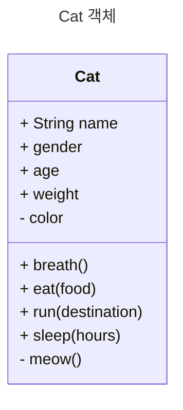

```mermaid
---
title: Cat 객체 
---
classDiagram
    class Cat
    Cat : + String name
    Cat : + gender
    Cat : + age
    Cat : + weight
    Cat : - color 
    Cat : + breath()
    Cat : + eat(food)
    Cat : + run(destination)
    Cat : + sleep(hours)
    Cat : - meow()
```

