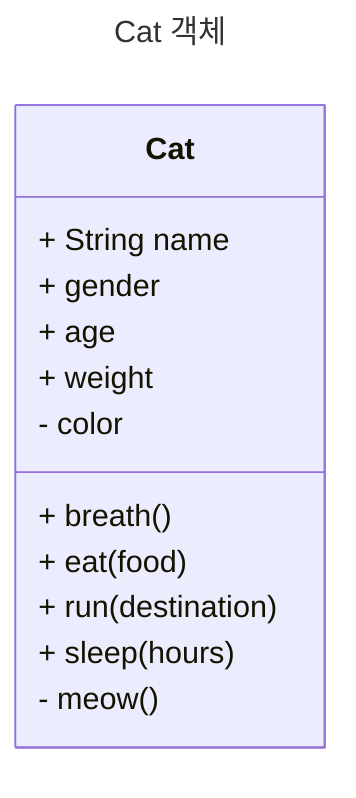
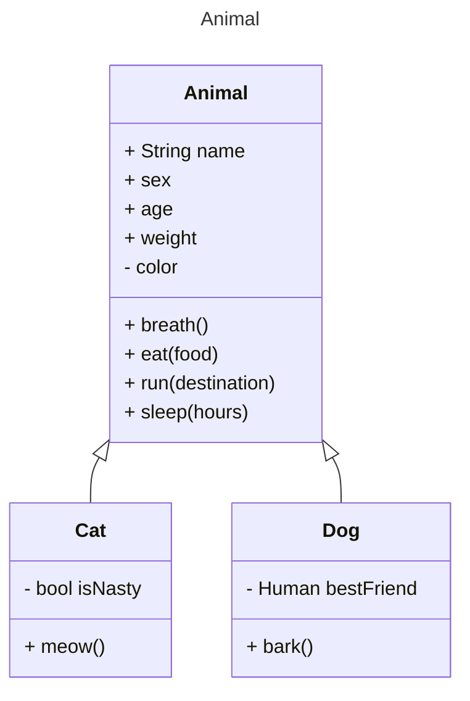

```mermaid
---
title: Cat 객체 
---
classDiagram
    class Cat
    Cat : + String name
    Cat : + gender
    Cat : + age
    Cat : + weight
    Cat : - color 
    Cat : + breath()
    Cat : + eat(food)
    Cat : + run(destination)
    Cat : + sleep(hours)
    Cat : - meow()
```

1. 클래스명
2. 필드들
3. 메서드들(행동)

>[!공개여부표시 방법]
>'+' : 공개
>'-'  : 비공개

```mermaid
---
title: Animal 
---
classDiagram
    class Animal
    Animal : + String name
    Animal : + sex
    Animal : + age
    Animal : + weight
    Animal : - color 
    Animal : + breath()
    Animal : + eat(food)
    Animal : + run(destination)
    Animal : + sleep(hours)

	class Cat
	Cat : - bool isNasty 
	Cat : + meow()

	class Dog
	Dog : - Human bestFriend 
	Dog : + bark()

	Animal <|-- Cat
	Animal <|-- Dog
    
```

* 위 화살표는 비어 있는 화살표이다.
* 비어있는 화살표의 실선일 경우 상속을 의미한다.

```mermaid
---
title: Airport 
---
classDiagram
    class Animal
    Animal : + String name
    Animal : + sex
    Animal : + age
    Animal : + weight
    Animal : - color 
    Animal : + breath()
    Animal : + eat(food)
    Animal : + run(destination)
    Animal : + sleep(hours)

	class Cat
	Cat : - bool isNasty 
	Cat : + meow()

	class Dog
	Dog : - Human bestFriend 
	Dog : + bark()

	Animal <|-- Cat
	Animal <|-- Dog
    
```