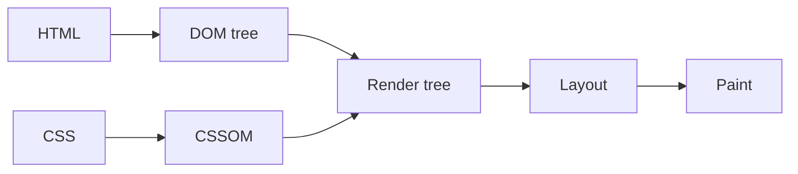

연결문서
[[웹페이지 렌더링 순서]]

```mermaid
flowchart LR
HTML --> dt[DOM tree]
CSS  --> CSSOM 
dt --> rt[Render tree]
CSSOM --> rt
rt --> Layout 
Layout --> Paint


```

렌더링 엔진은 서버로부터 응답된 HTML 과 CSS 를 파싱하여 각각 DOM 과 CSSOM를 생성한다.
그리고 DOM 과 CSSOM은 렌더링을 위해 렌더트리(Render tree)