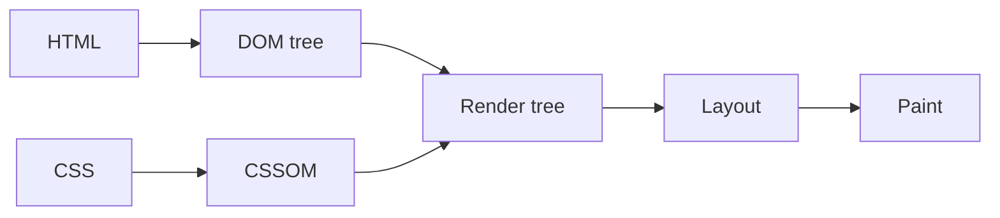

연결문서
[[웹페이지 렌더링 순서]]

### 서론

렌더링은 다음과 같은 과정으로 이루어진다. (자세한 내용은 [웹페이지 렌더링 순서] 참고)

렌더링 엔진은 서버로부터 응답된 HTML 과 CSS 를 파싱하여 각각 DOM 과 CSSOM를 생성한다.
그리고 DOM 과 CSSOM은 렌더링을 위해 렌더트리(Render tree)로 결합된다.  

  >[!question] 렌더 트리(Render tree)란?
  >렌더링을 위한 트리구조의 자료구조다. 브라우저 화면에 렌더링 되지 않는 노드(ex : meta태그, script태그 등 )와 CSS 에 의해 표시되지 않는(ex : display: none) 되는 노드들은 포함하지 않는다. 
  > 즉, 브라우저 화면에 렌더링 되는 노드만으로 구성된다. 

위의 렌더링 과정은 반복해서 실행될 수 있다. 그 예는 다음과 같다. 
* 자바스크립트에 의한 노드 추가 또는 삭제
* 브라우저 창의 리사이징에 의한 뷰포트(viewport) 크기 변경
* HTML 요소의 레이아웃(위치, 크기)에 변경을 발생시키는 width/height, margin, padding, border, display, position, top/right/bottom/left 등의 스타일 변경

  >[!question] 뷰포트(viewport) 는 
### 참고
* 모던 자바스크립트 (38장)

