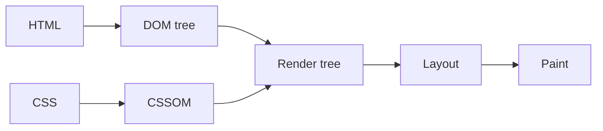

연결문서
[[Spring 의 구동원리]]

알 수 있는 내용 


### 주제



CSS 파싱과정과 마찬가지로 렌더링 엔진은 HTML을 위에서 아래로 순차적으로 파싱하며 DOM을 생성하다가 자바스크립트 파일을 로드하는 script 태그나 <font color="#e36c09"><strong><sup>1.</sup><u>자바스크립트 코드를 콘텐츠로 담은 script 태그를 만나면 DOM 생성을 일시 중단한다. </u></strong></font>

**<font color="#e36c09">예시 1.</font> 
```html

<!DOCTYPE html>
<html>
<body>

<h2>자바스크립트 예시</h2>

<button type="button" onclick="myFunction()">클릭!</button>

<script>
function myFunction() {
  alert("Hello, World!");
}
</script>

</body>
</html>

```

위 코드는 button 태그를 읽어 DOM 을 생성하다가 


### 참고
* 모던 자바스크립트 Deep Dive (38장)

