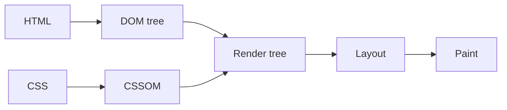

연결문서
[[Spring 의 구동원리]]

알 수 있는 내용 


### 주제



CSS 파싱과정과 마찬가지로 렌더링 엔진은 HTML을 위에서 아래로 순차적으로 파싱하며 DOM을 생성하다가 자바스크립트 파일을 로드하는 script 태그나 <font color="#e36c09"><strong><sup>1.</sup><u>자바스크립트 코드를 콘텐츠로 담은 script 태그를 만나면 DOM 생성을 일시 중단한다. (script태그로 감싸진 영역을 말함)</u></strong></font>

**<font color="#e36c09">예시 1.</font> 
```html

<!DOCTYPE html>
<html>
<body>

<h2>자바스크립트 예시</h2>
<!-- button dom 생성단계 에서는 onclick은 그냥 문자열로 인식됨.  -->
<button type="button" onclick="myFunction()">클릭!</button>

<!-- 자바스크립트 코드를 콘텐츠로 담은 script 영역 -->
<script> 
<!-- 함수가 정의되면 위 버튼태그의 onclick 속성에서 해당 함수를 참조하기 시작함.  -->
function myFunction() {
  alert("Hello, World!");
}
</script>

</body>
</html>

```

자바 스크립트 파싱과 실행은 브라우저의 렌더링 엔진이 아닌 자바스크립트 엔진이 처리한다. 
자바스크립트 엔진은 스크립트 코드를 파싱하여 CPU가 이해 할 수 있는 저수준언어로  변환하고 실행하는 역할을 한다. 자바스크립트 엔진은 구글 크롬과 Node.js의 V8, 파이어폭스의 SpiderMonkey가 있다. 렌더링 엔진으로부터 제어권을 넘겨받은 자바스크립트 엔진은 자바스크립트를 해석하여 AST(Abstract Syntax tree) 추상적 구문트리를 생성한다.  그리고 AST를 기반으로 인터 프리터가 실행 할 수 있는 바이트코드를 생성하여 실행한다.  


### 참고
* 모던 자바스크립트 Deep Dive (38장)

