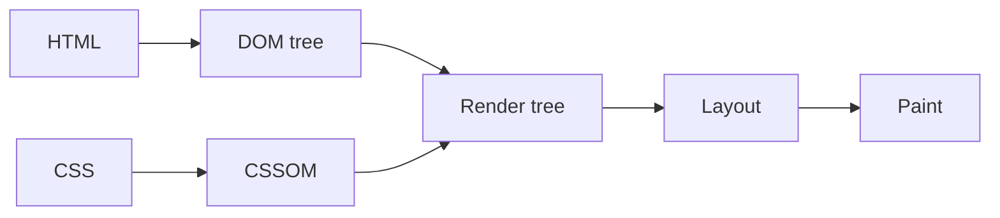

연결문서
[[Spring 의 구동원리]]

알 수 있는 내용 

### 주제

```mermaid
flowchart LR
HTML --> dt[DOM tree]
CSS  --> CSSOM 
dt --> rt[Render tree]
CSSOM --> rt
rt --> Layout 
Layout --> Paint


```

CSS 파싱과정과 마찬가지로 렌더링 엔진은 HTML을 위에서 아래로 순차적으로 파싱하며 

### 참고
* 

