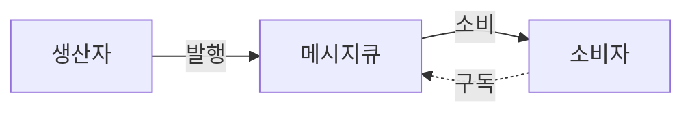

목표 : 규모 확장을 위해 웹계층, 데이터 계층, 응답시간 관점에서 이야기 할 수 있다. (수평적 규모확장의 관점으로 이야기할 것 )

##### 수직적 규모 확장 VS 수평적 규모 확장 

##### 수직적 규모 확장(scale up) 
더 좋은 고사양 자원(더 좋은  CPU, 더 많은 RAM 등)을 추가하는 행위 

단점 
* 수직적 규모 확장에는 한계가 있음(한 대의 서버에 CPU 나 메모리를 무한대로 증설할 방법은 없다. )
* 수직적 규모 확장법은 장애에 대한 자동복구(failover) 방안이나 다중화(redundancy) 방안을 설립하기 어려움
##### 수평적 규모 확장(scale out)
더 많은 서버를 추가하여 성능을 개선하는 행위

### 웹계층 관점

##### 무상태(stateless) 웹계층
상태정보(사용자 세션데이터와 같은)를 웹 계층에서 제거해야한다. 
상태정보를 관계형 데이터베이스나 NoSQL 같은 지속성 저장소에 보관하고 , 필요할 때 가져오도록 한다. 

###### 상태정보에 의존적인 아키텍처
클라이언트가 로드 밸런서에 의해 A,B,C로 분산되었더라하더라도 세션을 사용하는 경우, 클라이언트가 A 서버에서 세션데이터를 만들고 저장했다면 다음 요청도 A서버로 해야한다. 이를 지원하기위해 대부분의 로드밸런서가 고정세션(sticky session)을 제공하고 있지만 한 서버에만 요청이 과도하게 몰릴 수 있다.(로드밸런싱이 제대로 동작안할 수 있다. )

웹서버가 상태정보가 필요한경우 별도의 공유저장소(shared storage)에 저장할수도 있다. 
다음의 저장소에 저장하면 된다. 
1. **관계형 데이터베이스**:
    - **MySQL**: 세션 정보나 사용자 상태를 저장하는 데 사용.
    - **PostgreSQL**: 트랜잭션 관리가 필요한 상태 정보를 저장.
2. **NoSQL 데이터베이스**:
    - **Redis**: 메모리 기반의 데이터 저장소로, 빠른 읽기/쓰기가 필요한 세션 관리에 적합.(캐시시스템)
    - Memcached : 메모리 기반의 저장소 단순한 키-값 저장소로서 주로 캐싱 용도로만 사용됨.
    - **MongoDB**: 비정형 데이터나 유연한 스키마가 필요한 상태 정보를 저장.
3. **키-값 저장소**:
    - **Amazon DynamoDB**: 분산형 NoSQL 데이터베이스로, 상태 정보를 빠르게 읽고 쓸 수 있음.
4. **파일 저장소**:
    - **Amazon S3**: 객체 저장소로, 상태 정보를 파일 형태로 저장하고 관리.

#### 메시지 큐
메시지 큐란, 메시지의 무손실(durability)을 보장하는 , 비동기 통신(asynchronous communication)을 지원하는 컴포넌트이다. 여기서 무손실(durability)이란 메시지 큐에 일단 보관된 메시지는 소비자가 꺼낼 때까지 안전하게 보관된다는 특성을 말한다. 

메시지 큐의 기본 아키텍처는 생산자 또는 발행자(producer/publisher)라고 불리는 입력서비스가 메시지를 만들어 메시지큐에 발행(publish)한다. 큐에는 보통 소비자 혹은 구독자(consumer/subscriber)라고 불리는 서비스 혹은 서버가 연결되어있는데, 메시지를 받아 그에 맞는 동작을 수행하는 역할을 한다. 

### 데이터 계층 관점 

#### 어떤 데이터 베이스를 사용할 것인가? 
RDBMS vs NoSQL
NoSQL에는 익숙하지 않으므로 언제 NoSQL을 사용할 것인가? 에 초점을 맞춰 생각해본다.
##### NoSQL을 사용하면 좋은 경우
1. 아주 낮은 응답 지연시간(latency)이 요구되는 경우
2. 다루는 데이터가 비정형(unstructured)이라 관계형 데이터가 아님 (json 데이터, 자연어 데이터 )
3. 데이터를 직렬화하거나 역직렬화 할 수 있기만 하면 됨
4. 아주 많은 양의 데이터를 저장할 필요가 있음
##### NoSQL의 종류
1. 키-값 저장소(key-value store)
2. 그래프 저장소(graph store)
3. 칼럼저장소(column store)
4. 문서 저장소(document store) 
ex) elastic search : JSON 형태과 같은 문서형식으로 저장하며, 정형 데이터뿐만 아니라 비정형 데이터도 효과적으로 처리할 수 있습니다. 여기서 말하는 문서란 JSON 형식의 문자열을 의미한다. 
이 문자열은 다양한 방법으로 인덱싱할수있다 
1. ["Hello to the world"] 를 통채로 할 수도 있고,
2. ["hello", "to", "the", "world"] 각각의 단어들로 할 수도 있고,
3. ["hello", "world"]  의미있는 단어로만 할 수도 있다. 
이렇게 토큰화 된 단어들이 인덱스 키가 되어 훨씬빠르고 효율적인 문서 검색을 진행한다.
SQL데이터베이스들은 많은 인덱스를 다룰 때 성능이 저하되는 반면, 엘라스틱 서치는 복잡하고 상당한 양의 인덱스를 다루더라도 성능에 저하가 거의 없다. 그리고 찾은 데이터를 효과적으로 다루는 능력도 가지고 있다. 
단점은 개별레코드 검색(RDB에 비해)이 느린편이며, 복잡한 조인인 쿼리는 불가능하다.

##### 데이터베이스 다중화 
	데이터베이스 서버의 역할을 master-slave로 구분하고  데이터 원본은 master에 사본은 slave 서버에 저장한다. slave 서버에서는 read 만 가능하고 master 서버에서는 read, write 둘다 가능하다. 

### 응답시간관점 

##### 캐시

##### 캐시 계층

##### 캐시 사용 시 유의할 점 

##### 콘텐츠 전송 네트워크(CDN)
지리적으로 분산된 여러 서버를 가지고있어서 사용자가 웹사이트에 방문하면, 그 사용자에게 가장 가까운 CDN 서버가 정적 콘텐츠를 전달한다. 물론 사용자가 CDN이 제공하는 서버보다 운영웹서버에 더 가까우면 웹서버에 직접 요청하는 것이 더 빠를 수는 있다.(보편적이지는 않음.)

 CDN 사용시 고려해야할 사항
 1. 비용 : CDN을 통해 들어가고 나가는 데이터 전송 양에 따라 요금을 낸다.  
 2. 자주 사용되지 않는 콘텐츠를 캐싱하는 것은 이득이 작기 때문에 빼는 것이 좋을 수 있다. 
 3. 적절한 만료 시한 설정(너무 길면 컨텐츠 최신화가 안될거고 너무짧으면 빈번한 호출이 되어버림)
 4. CDN에서 장애가 발생할경우 대응방법에 대해 고려해야함 (ex. CDN 서버가 응답하지 않을 경우 해당 문제를 감지하여 원본 서버로부터 직접 콘텐츠를 가져오도록 구성 )
 5. 콘텐츠 무효화(invalidation) : 아직 만료되지 않은 콘텐츠라 하더라도 필요에 따라 처리해야할 수 있다.
     처리방법
     * CDN 서비스 사업자가 제공하는 API를 이용하여 콘텐츠 무효화
     * 콘텐츠의 다른 버전을 서비스 하도록 오브젝트 버저닝(object versioning)사용 . 콘텐츠의 새로운 버전을 지정하기위해 URL 마지막에 버전번호를 인자로 주면 됨. (ex. image.png?v=2)

 

